# Information Architecture (IA)

CDE (Credit Decision Engine) 전체 정보 구조

```mermaid
graph TD
    CDE[CDE - Credit Decision Engine]
    
    CDE --> Auth[🔐 Login/Authentication]
    Auth --> Login[로그인]
    Auth --> PwChange[비밀번호 변경]
    Auth --> AccLock[계정 잠금/해제]
    
    CDE --> Dashboard[📊 Dashboard]
    Dashboard --> Metrics[주요 지표]
    Dashboard --> Charts[차트/통계]
    Dashboard --> Recent[최근 활동]
    
    CDE --> Project[📁 Project]
    Project --> ProjList[프로젝트 리스트]
    Project --> ProjCreate[프로젝트 생성/수정/삭제]
    
    Project --> Param[Parameter]
    Param --> Original[원본변수]
    Original --> DirectInput[직접 입력]
    Original --> Import[Import - File/URL/Model/Project]
    Original --> DSQuery[DataStore 쿼리]
    Original --> ParamMap[Parameter Mapping]
    
    Param --> Derived[파생변수]
    Derived --> VarCreate[변수 생성 - Condition/Result]
    Derived --> DefaultVal[Default 값 설정]
    Derived --> CondTest[컨디션 테스트]
    
    Project --> Segment[Segment]
    Segment --> ParamSelect[파라미터 선택 1-3개]
    Segment --> MatrixGen[매트릭스 생성]
    Segment --> SegName[세그먼트 영역 이름 설정]
    
    Project --> Scoring[Scoring]
    Scoring --> ScoreCard[Score Card]
    ScoreCard --> ParamScore[파라미터 선택/스코어/가중치]
    ScoreCard --> GradeSet[등급 구간 설정]
    
    Scoring --> AIModel[AI Model]
    AIModel --> ModelSelect[모델 선택]
    AIModel --> ModelMap[Model Mapping]
    AIModel --> Scaling[스케일링/등급 조정]
    
    Project --> Rule[Rule]
    Rule --> CondGroup[Condition Group 생성]
    CondGroup --> StaticCond[Static Condition]
    CondGroup --> BehaviorPat[Behavior Pattern]
    CondGroup --> MixedCond[Static + Behavior]
    Rule --> DecisionSet[Decision 설정 - Approve/Reject/Pending]
    Rule --> Priority[Priority 설정]
    Rule --> Override[Override 설정]
    Rule --> RuleTest[Rule Test]
    
    Project --> Policy[Policy]
    Policy --> PolicyType[Policy 타입 선택]
    PolicyType --> RulesOnly[Rules Only]
    PolicyType --> MatrixOnly[Matrix Only]
    PolicyType --> RuleMatrix[Rule + Matrix]
    
    Policy --> PolicyCreate[Policy 생성]
    PolicyCreate --> RuleSelect[Rule 선택]
    PolicyCreate --> SegScoreSelect[Segment/Scoring 선택]
    PolicyCreate --> MatrixDec[Matrix Decision 설정]
    PolicyCreate --> ElseDec[Else Decision 설정]
    
    Policy --> Approval[Policy Approval Flow]
    Approval --> Pending[Pending - 대기]
    Approval --> Requested[Requested - 승인 요청]
    Approval --> Withdrawn[Withdrawn - 결재 취소]
    Approval --> Approved[Approved - 승인]
    Approval --> Rejected[Rejected - 거절]
    Approval --> Revoked[Revoked - 승인 취소]
    Approval --> Scheduled[Scheduled - 운영 예약]
    Approval --> Active[Active - 운영 중]
    Approval --> Canceled[Canceled - 운영 취소]
    
    Project --> ActiveHist[Active History]
    ActiveHist --> OpHistory[운영 이력 조회]
    ActiveHist --> Versioning[버전 관리]
    ActiveHist --> Rollback[롤백 - 사후 승인]
    
    CDE --> TestSim[🧪 Test & Simulation]
    TestSim --> PolicyTest[Policy Test]
    PolicyTest --> ChampChall[챔피온/챌린저 선택]
    PolicyTest --> TestPeriod[테스트 기간 설정]
    PolicyTest --> TargetCond[타겟 조건 설정]
    PolicyTest --> TestExec[테스트 실행/일시정지/취소]
    PolicyTest --> TestReport[결과 레포트 - 회차별]
    
    TestSim --> Simulation[Simulation]
    Simulation --> TestTarget[Test Target 선택]
    Simulation --> HistData[Historical Data Period 선택]
    Simulation --> Baseline[Baseline Policy 선택]
    Simulation --> SimExec[시뮬레이션 실행]
    Simulation --> SimResult[결과 분석]
    
    CDE --> AIModelMenu[🤖 AI Model]
    AIModelMenu --> ModelList[모델 리스트]
    AIModelMenu --> ModelInfo[모델 정보 조회]
    AIModelMenu --> ModelReg[모델 등록/수정]
    
    CDE --> DataStore[💾 Data Store]
    DataStore --> DSExplore[데이터 소스 탐색]
    DataStore --> SchemaTable[스키마/테이블 조회]
    DataStore --> SampleData[샘플 데이터 확인]
    DataStore --> ConnStatus[연결 상태 모니터링]
    
    CDE --> Management[👥 Management - Master 전용]
    Management --> UserMgmt[User]
    UserMgmt --> UserCreate[사용자 생성]
    UserMgmt --> UserList[사용자 리스트]
    UserMgmt --> AuthMgmt[권한 관리 - Master/Manager/User]
    UserMgmt --> PwReset[비밀번호 초기화]
    
    Management --> Usage[Usage]
    Usage --> TxStats[트랜잭션 통계]
    Usage --> MonthUsage[이번 달 사용량]
    Usage --> YearUsage[연간 사용량]
    
    CDE --> Notification[🔔 Notification]
    Notification --> PolicyNoti[폴리시 결재 알림]
    Notification --> RollbackNoti[롤백 사후 승인 알림]
    Notification --> SysNoti[시스템 알림]
    
    style CDE fill:#e1f5ee
    style Auth fill:#fbeaf0
    style Dashboard fill:#e6f1fb
    style Project fill:#eeedfe
    style TestSim fill:#faeeda
    style AIModelMenu fill:#faece7
    style DataStore fill:#e6f1fb
    style Management fill:#faece7
    style Notification fill:#fbeaf0
```

## 주요 메뉴 구조

### 1. 인증 (Authentication)
- 로그인/로그아웃
- 세션 관리 (30분)
- 비밀번호 정책

### 2. 프로젝트 (Project)
프로젝트별 의사결정 정책 구성:
- **Parameter**: 원본변수 + 파생변수
- **Segment**: 고객 세그먼트 매트릭스
- **Scoring**: Score Card / AI Model
- **Rule**: 의사결정 규칙
- **Policy**: 최종 정책 (Rule/Matrix 조합)
- **Active History**: 운영 이력 및 버전 관리

### 3. 테스트 & 시뮬레이션
- **Policy Test**: 챔피언/챌린저 A/B 테스트
- **Simulation**: 과거 데이터 기반 시뮬레이션

### 4. AI Model
- BentoML 연동
- 모델 관리 및 메타데이터

### 5. Data Store
- 외부 데이터 소스 연동
- SQL 쿼리 기반 변수 추출

### 6. Management (Master 전용)
- 사용자 관리
- 사용량 통계

### 7. Notification
- 폴리시 결재 상태 알림
- 2주 보관

## 권한별 접근 제어

| 메뉴 | Master | Manager | User |
|------|--------|---------|------|
| Dashboard | ✅ | ✅ | ✅ |
| Project | ✅ | ✅ (Read/Update) | ✅ (CRUD) |
| Test & Simulation | ✅ | ✅ | ✅ |
| AI Model | ✅ | ✅ | ✅ |
| Data Store | ✅ | ✅ | ✅ |
| Management | ✅ | ❌ | ❌ |
| Policy Approval | - | ✅ (승인/거절) | ✅ (요청) |
