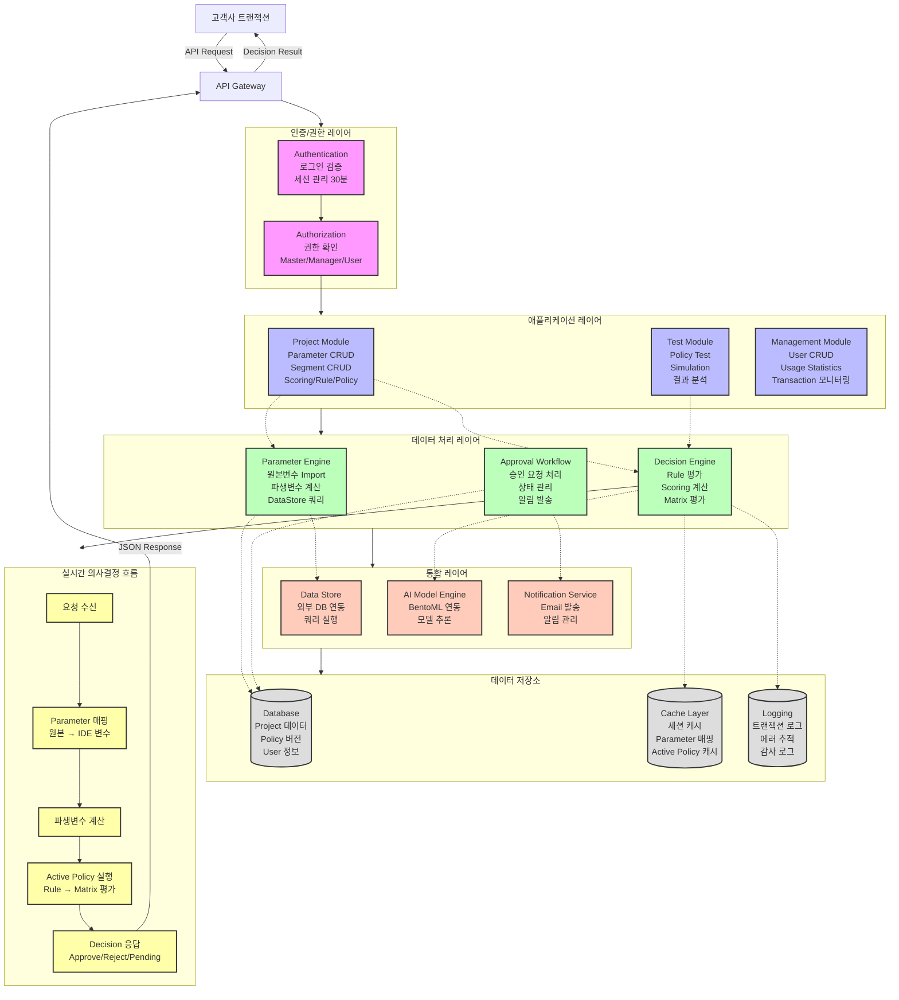

# 시스템 아키텍처

CDE (Credit Decision Engine) 전체 시스템 아키텍처 및 데이터 흐름

## 시스템 계층 구조

### 1. 인증/권한 레이어 (Authentication & Authorization Layer)

**Authentication**
- 로그인 검증
- 세션 생성 및 관리 (30분 유효)
- 비밀번호 정책 검증
- 계정 잠금 처리 (5회 실패 시 30분)

**Authorization**
- 권한 확인 (Master/Manager/User)
- 메뉴별 접근 제어
- 기능별 권한 검증

### 2. 애플리케이션 레이어 (Application Layer)

**Project Module**
- Parameter CRUD
  - 원본변수: 직접입력/Import/DataStore 쿼리
  - 파생변수: Condition/Result 기반 생성
- Segment CRUD
  - 1-3개 파라미터 조합 매트릭스
- Scoring CRUD
  - Score Card: 가중치 기반
  - AI Model: BentoML 연동
- Rule CRUD
  - Condition Group (Static/Behavior)
  - Priority 기반 평가
- Policy CRUD
  - Rules Only / Matrix Only / Rule+Matrix

**Test Module**
- Policy Test
  - 챔피언/챌린저 A/B 테스트
  - 실시간 비교 분석
- Simulation
  - 과거 데이터 기반 시뮬레이션
  - What-if 분석
- 결과 분석
  - 회차별 레포트
  - 통계 대시보드

**Management Module** (Master 전용)
- User CRUD
  - 사용자 생성/수정/삭제
  - 권한 할당
  - 비밀번호 초기화
- Usage Statistics
  - 트랜잭션 통계
  - 월간/연간 사용량
- Transaction 모니터링

### 3. 데이터 처리 레이어 (Data Processing Layer)

**Parameter Engine**
- 원본변수 Import
  - File/URL/Model/Project 지원
  - 유효성 검증
  - 중복 체크
- 파생변수 계산
  - Condition 평가
  - Result 값 도출
  - Default 처리
- DataStore 쿼리
  - SQL 실행
  - 바인드 변수 처리
  - 단일 행 검증

**Decision Engine**
- Rule 평가
  - Priority 순서 평가
  - Condition Group 매칭
  - Override 처리
  - Approve/Reject/Pending 결정
- Scoring 계산
  - Score Card: 가중치 합산
  - AI Model: 모델 추론
  - Grade 결정
- Matrix 평가
  - Segment 매칭
  - Scoring 계산
  - Matrix Decision 도출

**Approval Workflow**
- 승인 요청 처리
  - User → Manager 요청
  - 코멘트 관리
- 상태 관리
  - 10단계 상태 전환
  - Pending/Requested/Approved/Rejected 등
- 알림 발송
  - Manager: Requested/Withdrawn
  - User: Approved/Rejected/Revoked
  - 14일 보관

### 4. 통합 레이어 (Integration Layer)

**Data Store**
- 외부 DB 연동
  - Push/Pull 방식
  - 주기적 동기화
- 쿼리 실행
  - SQL 쿼리 처리
  - 바인드 변수 매핑
  - 결과 캐싱

**AI Model Engine**
- BentoML 연동
  - 모델 메타데이터 조회
  - Feature 매핑
- 모델 추론
  - 실시간 예측
  - 스케일링 처리

**Notification Service**
- Email 발송
  - 비밀번호 난수 생성
  - 결재 상태 알림
- 알림 관리
  - 14일 보관
  - 자동 삭제

### 5. 데이터 저장소 (Storage Layer)

**Database**
- Project 데이터
  - Parameter/Segment/Scoring/Rule/Policy
- Policy 버전
  - 타임스탬프 버저닝
  - Active History
- User 정보
  - 계정 정보
  - 권한 정보
  - 삭제 계정 90일 보관

**Cache Layer**
- 세션 캐시
  - 30분 유효
  - 동시 접속 방지
- Parameter 매핑
  - IDE 변수 ↔ 고객사 변수
- Active Policy 캐시
  - 운영 중인 폴리시
  - 빠른 조회

**Logging**
- 트랜잭션 로그
  - 요청/응답 기록
  - 처리 시간
- 에러 추적
  - 에러 스택
  - 디버깅 정보
- 감사 로그
  - 사용자 액션
  - 결재 이력

## 실시간 의사결정 흐름

### 1. 요청 수신
- 고객사 트랜잭션 API 요청
- API Gateway 라우팅

### 2. Parameter 매핑
- 고객사 변수 → IDE 원본변수
- 매핑 테이블 조회
- 1:1 매핑 검증

### 3. 파생변수 계산
- Condition 평가
- Result 값 도출
- Default 처리

### 4. Active Policy 실행
- 캐시에서 Active Policy 조회
- Policy Type 확인
  - **Rules Only**: Rule Priority 순 평가 → Else Decision
  - **Matrix Only**: Segment 매칭 → Scoring → Matrix Decision
  - **Rule+Matrix**: Rule 평가 → Approve만 Matrix 진행

### 5. Decision 응답
- JSON 포맷 응답
- Decision (Approve/Reject/Pending)
- Attributes 값 포함
- Transaction ID

## 성능 요구사항

### SLA
- 지연허용치: 기본 설정 (고객사와 협의)
- 쿼리 실행시간: 0.5초 이하 권장
- 응답시간: SLA 보장

### 캐싱 전략
- Active Policy: 캐시 우선 조회
- Parameter 매핑: 메모리 캐싱
- 세션 정보: Redis 캐싱

### 스케일링
- 수평 확장 가능한 아키텍처
- Stateless 애플리케이션 서버
- 캐시 레이어 분리

## 보안 요구사항

### 인증/인가
- 세션 기반 인증
- 30분 타임아웃
- 동시 접속 방지

### 데이터 암호화
- 비밀번호 암호화 저장
- HTTPS 통신
- 민감 정보 마스킹

### 로깅/모니터링
- 전체 트랜잭션 로그
- 에러 추적
- 감사 로그 (90일 보관)

## 확장성

### 모듈화
- 각 레이어 독립적으로 확장 가능
- 마이크로서비스 아키텍처 고려

### 플러그인
- 새로운 데이터 소스 추가 용이
- AI 모델 엔진 확장 가능
- 알림 채널 추가 가능

### API 버저닝
- API 버전 관리
- 하위 호환성 유지
