# 파라미터 처리 시스템 플로우

원본변수와 파생변수 처리 및 매핑 프로세스

```mermaid
flowchart TD
    %% Parameter Input Sources
    Start[파라미터 입력 요청] --> InputType{입력 소스 선택}
    
    InputType -->|직접 입력| DirectInput[직접 입력<br/>변수명/타입/밸류]
    InputType -->|파일| FileUpload[File Upload<br/>CSV/Excel]
    InputType -->|URL| URLImport[URL Import<br/>외부 주소]
    InputType -->|모델| ModelImport[Model Import<br/>AI Model Dataset]
    InputType -->|프로젝트| ProjectImport[Project Import<br/>다른 프로젝트]
    InputType -->|쿼리| QueryInput[DataStore Query<br/>SQL 쿼리 작성]
    
    %% Validation Layer
    DirectInput --> Validate
    FileUpload --> FileValidate[파일 형식 체크<br/>샘플 형식 검증]
    URLImport --> URLValidate[URL 유효성 체크<br/>데이터 추출]
    ModelImport --> ModelValidate[모델 위치 체크<br/>Dataset 추출]
    ProjectImport --> ProjValidate[프로젝트 선택<br/>원본/파생 선택]
    QueryInput --> QueryValidate[쿼리 작성<br/>바인드 변수 설정]
    
    FileValidate --> Validate[유효성 검증]
    URLValidate --> Validate
    ModelValidate --> Validate
    ProjValidate --> Validate
    QueryValidate --> QueryTest[쿼리 테스트]
    
    QueryTest --> TestResult{테스트 결과}
    TestResult -->|단일 행 반환| QueryPass[쿼리 통과]
    TestResult -->|복수 행| QueryError[에러: 단일 행 필요]
    TestResult -->|0.5s 초과| QueryWarn[경고: 성능 확인<br/>계속 진행 가능]
    
    QueryError --> QueryInput
    QueryWarn --> QueryPass
    QueryPass --> Validate
    
    %% Validation Process
    Validate --> ValCheck{검증 항목}
    
    ValCheck --> TypeCheck[타입 검증<br/>String/Number/Category/Datetime]
    ValCheck --> NameCheck[변수명 검증<br/>4-16자, 영문숫자기호]
    ValCheck --> ValueCheck[밸류 검증<br/>Category는 밸류 필수]
    
    TypeCheck --> DupCheck
    NameCheck --> DupCheck
    ValueCheck --> DupCheck
    
    %% Duplicate Check
    DupCheck[중복 체크] --> CompareExist{기존 변수와 비교}
    
    CompareExist -->|이름만 중복| NameDup[이름 중복<br/>타입/밸류 다름]
    CompareExist -->|이름+타입 중복| TypeDup[이름+타입 중복<br/>밸류 다름]
    CompareExist -->|완전 중복| FullDup[완전 중복<br/>이름+타입+밸류 동일]
    CompareExist -->|중복 없음| NoDup[중복 없음<br/>저장 가능]
    
    NameDup --> DupAction{중복 처리}
    TypeDup --> DupAction
    
    DupAction -->|이름 변경| RenamePar[변수명 변경]
    DupAction -->|기존 삭제| DeleteOld[기존 변수 삭제]
    DupAction -->|취소| Cancel[Import 취소]
    
    RenamePar --> NoDup
    DeleteOld --> NoDup
    Cancel --> Start
    
    FullDup --> NotImport[가져오기 불가<br/>체크박스 비활성화]
    NotImport --> Start
    
    %% Save Process
    NoDup --> SaveOriginal[원본변수 저장]
    SaveOriginal --> SortParam[정렬<br/>0-9, A-Z, ㄱ-ㅎ]
    SortParam --> ParamMapping[Parameter Mapping]
    
    %% Parameter Mapping
    ParamMapping --> MapType{매핑 유형}
    
    MapType -->|일반 매핑| NormalMap[IDE 변수 → 고객사 변수<br/>1:1 매핑]
    MapType -->|No Mapping| NoMap[No Mapping<br/>테스트용 변수]
    MapType -->|DataStore| DSNoMap[DataStore 변수<br/>매핑 불필요]
    
    NormalMap --> MapSave[매핑 테이블 저장]
    NoMap --> MapSave
    DSNoMap --> Complete
    
    MapSave --> InUseCheck{In Use 상태?}
    
    InUseCheck -->|파생변수 사용| InUse[In Use 🔗<br/>수정 불가]
    InUseCheck -->|룰 사용| InUse
    InUseCheck -->|스코어링 사용| InUse
    InUseCheck -->|세그먼트 사용| InUse
    InUseCheck -->|사용 안됨| NotInUse[수정 가능]
    
    InUse --> Complete[원본변수 완료]
    NotInUse --> Complete
    
    %% Derived Variable Flow
    Complete --> DerivedOption{파생변수 생성?}
    
    DerivedOption -->|Yes| DerivedStart[파생변수 생성]
    DerivedOption -->|No| End[완료]
    
    DerivedStart --> SelectBase[기반 변수 선택<br/>원본 또는 파생]
    SelectBase --> DefineType[변수 타입 정의<br/>String/Number/Category]
    DefineType --> SetCondition[Condition 설정]
    
    SetCondition --> CondType{조건 구성}
    
    CondType -->|단일 조건| SingleCond[단일 Condition<br/>If-Then]
    CondType -->|복합 조건| MultiCond[복합 Condition<br/>AND/OR 조합]
    
    SingleCond --> SetResult
    MultiCond --> SetResult[Result 값 설정]
    
    SetResult --> ResultType{Result 타입}
    
    ResultType -->|Manual| ManualResult[수동 입력<br/>고정 값]
    ResultType -->|Formula| FormulaResult[공식 입력<br/>계산 값]
    
    ManualResult --> SetDefault
    FormulaResult --> SetDefault[Default 값 설정<br/>조건 외 처리]
    
    SetDefault --> DefaultType{Default 유형}
    
    DefaultType -->|값 입력| DefaultValue[Default 값]
    DefaultType -->|Null| DefaultNull[Null 처리]
    
    DefaultValue --> TestOption
    DefaultNull --> TestOption{컨디션 테스트?}
    
    TestOption -->|Yes| CondTest[테스트 값 입력<br/>모든 파라미터]
    TestOption -->|No| SaveDerived
    
    CondTest --> TestExecute[테스트 실행<br/>Result별 카운트]
    TestExecute --> TestReview[결과 확인]
    TestReview --> TestAction{테스트 결과}
    
    TestAction -->|수정| SetCondition
    TestAction -->|확인| SaveDerived[파생변수 저장]
    
    SaveDerived --> DerivedComplete[파생변수 완료]
    
    %% In Use Management
    DerivedComplete --> DerivedInUse{In Use?}
    
    DerivedInUse -->|사용 중| DerivedLock[In Use 🔗<br/>수정 불가<br/>복제만 가능]
    DerivedInUse -->|미사용| DerivedEdit[수정 가능]
    
    DerivedLock --> End
    DerivedEdit --> End
    
    %% Import List Management
    Complete -.삭제 규칙.-> ImportList[Import 리스트 관리]
    
    ImportList --> ListType{Import 소스}
    ListType -->|File| FileList[File명 리스트]
    ListType -->|URL| URLList[URL 리스트]
    ListType -->|Model| ModelList[Model명 리스트]
    ListType -->|Project| ProjList[Project명 리스트]
    
    FileList --> DeleteRule[삭제 시<br/>해당 소스로 가져온<br/>변수만 삭제]
    URLList --> DeleteRule
    ModelList --> DeleteRule
    ProjList --> DeleteRule
    
    DeleteRule -.-> End
    
    %% Styling
    classDef inputStyle fill:#e1f5ee,stroke:#333,stroke-width:2px
    classDef validateStyle fill:#faeeda,stroke:#333,stroke-width:2px
    classDef processStyle fill:#e6f1fb,stroke:#333,stroke-width:2px
    classDef errorStyle fill:#faece7,stroke:#333,stroke-width:2px
    classDef successStyle fill:#eaf3de,stroke:#333,stroke-width:2px
    classDef decisionStyle fill:#fbeaf0,stroke:#333,stroke-width:2px
    
    class DirectInput,FileUpload,URLImport,ModelImport,ProjectImport,QueryInput inputStyle
    class Validate,ValCheck,TypeCheck,NameCheck,ValueCheck validateStyle
    class SaveOriginal,SortParam,ParamMapping,MapSave,SaveDerived processStyle
    class QueryError,NameDup,TypeDup,FullDup,NotImport errorStyle
    class Complete,DerivedComplete,End successStyle
    class InputType,CompareExist,DupAction,MapType,InUseCheck,DerivedOption,CondType,ResultType,DefaultType,TestOption,TestAction,DerivedInUse,ListType decisionStyle
```

## 원본변수 생성 프로세스

### 1. 입력 소스 (6가지)

#### 직접 입력
- 변수명, 타입, 밸류(Category만) 입력
- 즉시 검증

#### File Upload
- CSV/Excel 파일
- 샘플 형식 검증
- 대량 변수 등록

#### URL Import
- 외부 주소에서 데이터 가져오기
- URL 유효성 체크

#### Model Import
- AI Model의 Dataset 가져오기
- 모델 위치 체크
- Feature → 원본변수 변환
- **타입/밸류 수정 불가** (이름만 수정 가능)

#### Project Import
- 다른 프로젝트에서 가져오기
- 원본변수/파생변수 선택 가능
- 파생변수 가져올 경우 파생변수 리스트에도 등록

#### DataStore Query
- SQL 쿼리 작성
- 바인드 변수 (`:name`) 지원
- 쿼리 테스트 필수

### 2. 유효성 검증

#### 파일 형식 체크
- CSV/Excel 형식
- 샘플 파일과 일치 여부

#### 변수명 검증
- 영문, 숫자, 기호(-,_,. 만)
- 4자 이상 16자 이하

#### 타입 검증
- **String**: 텍스트형, 특수문자 포함 가능
- **String Category**: 제한된 범주의 텍스트
- **Number**: 정수 또는 실수
- **Numeric Category**: 제한된 범주의 숫자
- **Datetime**: 날짜/시간, 형식 지정 필요

#### 밸류 검증
- Category 타입은 밸류 필수
- 사전 정의된 값 목록

### 3. 중복 체크 정책

#### 중복 유형

**이름만 중복 (타입/밸류 다름)**
- 처리 방법:
  - 변수명 변경
  - 기존 변수 삭제
  - Import 취소

**이름+타입 중복 (밸류 다름)**
- Category 밸류가 다른 경우
- 처리 방법: 이름만 중복과 동일

**완전 중복 (이름+타입+밸류 동일)**
- Import 불가
- 체크박스 비활성화

**중복 없음**
- 바로 저장 가능

### 4. 저장 및 정렬

#### 저장
- Database에 원본변수 저장
- 메타데이터 포함

#### 정렬
- **0-9**: 숫자 우선
- **A-Z**: 대문자 우선
- **ㄱ-ㅎ**: 한글

### 5. Parameter Mapping

#### 매핑 유형

**일반 매핑 (Normal Mapping)**
- IDE 원본변수 → 고객사 파라미터
- 1:1 매핑
- 매핑 테이블 저장

**No Mapping**
- 테스트용 변수
- 고객사가 보내지 않는 파라미터

**DataStore 변수**
- 쿼리로 추출한 변수
- 매핑 불필요

#### 매핑 테이블
- IDE 변수명
- 고객사 변수명
- 매핑 상태

## 파생변수 생성 프로세스

### 1. 기반 변수 선택
- 원본변수 또는 파생변수 선택
- 여러 개 선택 가능

### 2. 변수 타입 정의
- Result 값의 타입에 따라 결정
- String/Number/Category

### 3. Condition 설정

#### 단일 조건
- If-Then 구조
- 하나의 조건과 결과

#### 복합 조건
- AND/OR 조합
- 여러 조건 결합

### 4. Result 값 설정

#### Manual (수동 입력)
- 고정 값
- 사용자가 직접 입력

#### Formula (공식)
- 계산 값
- 수식 사용

### 5. Default 값 설정
- 모든 조건에 해당하지 않을 때
- Null 처리 가능

### 6. 컨디션 테스트 (선택)

#### 테스트 과정
1. 테스트 값 입력
   - 모든 파라미터에 값 입력
   - 중복 파라미터는 1개만 출력
2. 테스트 실행
   - Condition 평가
   - Result별 카운트
3. 결과 확인
   - 각 Result에 부합한 Condition 개수
   - 검증

### 7. 저장
- Database에 파생변수 저장
- Condition/Result 메타데이터 포함

## In Use 상태 관리

### In Use 정의
다음 중 하나에 사용되는 경우:
- 파생변수
- 룰
- 스코어링
- 세그먼트

### 제한 사항

#### 원본변수 In Use
- 변수명 수정 불가
- 타입 수정 불가
- Category 밸류 수정 불가
- 삭제 불가 (체크박스 비활성화)
- **복제만 가능**

#### 파생변수 In Use
- 동일 제한 사항 적용
- 복제 후 수정하여 교체

### 표시
- 🔗 아이콘 출력
- In Use 배너
- Currently In Use 상세 조회

## DataStore 쿼리 정책

### 쿼리 작성 규칙

#### 바인드 변수
- 형식: `:변수명`
- 예시: `SELECT AVG(amt) FROM TB_CARD WHERE user_id = :user_id`
- **사전 등록 필수**: 쿼리에 사용되는 바인드 변수는 반드시 원본변수로 미리 등록

#### 단일 행 검증
- **쿼리 결과는 반드시 1개의 로우만 반환**
- 복수 로우 반환 시 등록 불가
- 집계 함수(`AVG`, `MAX`, `COUNT`) 사용 권장

#### 성능 검증
- **쿼리 실행시간 0.5초 이하 권장**
- 초과 시 경고 메시지 출력
- 시스템 제한은 하지 않음

### 쿼리 테스트

#### 테스트 과정
1. 바인드 변수에 테스트 값 입력
2. 쿼리 실행
3. 결과 확인:
   - 단일 행 반환 여부
   - 반환 타입 일치 여부
   - 실행 시간

#### 등록 조건
- 단일 행 반환
- 타입 일치
- SQL 문법 오류 없음

### 운영 중 예외 처리

#### 결과값 부재 (No Data Found)
- 에러 내지 않음
- `0` 또는 `Null` 반환

#### 연결 장애
- 데이터 스토어 연결 단절 시
- 원본변수 호출 단계에서 `Error` 회신

## Import 리스트 관리

### Import 리스트 정의
- File/URL/Model/Project에서 가져온 이력
- 파일명 또는 소스명 표시
- 삭제 버튼 포함

### 삭제 규칙

#### 기본 규칙
- **Import 리스트 삭제 시 해당 소스로 가져온 변수만 삭제**
- 중복으로 가져오지 않은 변수는 영향 없음

#### 예시
1. `파일A`로 A, B, C, D, E, F 변수 Import
2. `파일B`로 A, B, C, H, I, Z 변수 Import 시도
   - A, B, C는 이미 존재 (완전 중복)
   - H, I, Z만 실제 Import
3. `파일B` 삭제 시:
   - H, I, Z만 삭제
   - A, B, C는 `파일A`에서 가져왔으므로 유지

### 다중 종속 관계
- 추후 FE/BE 함께 논의 필요
- 충돌 시나리오 검토
- 오버헤드 최적화

## Category 타입 외 값 처리

### 기본 정책
**에러 처리하지 않고 Flow 진행**

#### 세그먼트에 사용된 경우
- 이외의 값이 들어온 파라미터는 매칭 실패
- 고객사에 응답 시 해당 내용 반영하여 에러 회신

#### 스코어링에 사용된 경우
- 이외의 값은 0점 처리
- 고객사에 응답 시 flag 달아 회신
- 예시: `{parameter: "status", value: "unknown", score: 0}`

### 대체 정책 (고객사 요청 시)
**Flow 전에 바로 에러 반환**
- 구축 시 고객사 요청에 따라 선택 가능
- 즉시 에러 회신

## 정렬 정책

### 원본변수 정렬
- **입력/Import 순서 역순**으로 먼저 나열
- **[Save] 클릭 시점**에 정렬 적용
  - 0-9
  - A-Z (대문자 우선)
  - ㄱ-ㅎ

### 재입력 시
- 기존 정렬 유지
- 새로 입력한 변수는 최상단에 역순 배치
- [Save] 시점에 전체 재정렬

## 특이사항

### 모델에서 가져온 변수
- **이름만 수정 가능**
- 타입/밸류 수정 불가
- 스코어링에서 파라미터명 매핑 필요

### 프로젝트에서 파생변수 가져오기
- 파생변수 선택 시 파생변수 리스트에 등록
- 파생변수에 사용된 원본변수는 자동으로 In Use 처리
- Import 리스트 삭제 시 원본+파생 모두 삭제

### DataStore 변수
- Parameter Mapping 불필요
- In Use 체크 없음
- 쿼리만 저장
