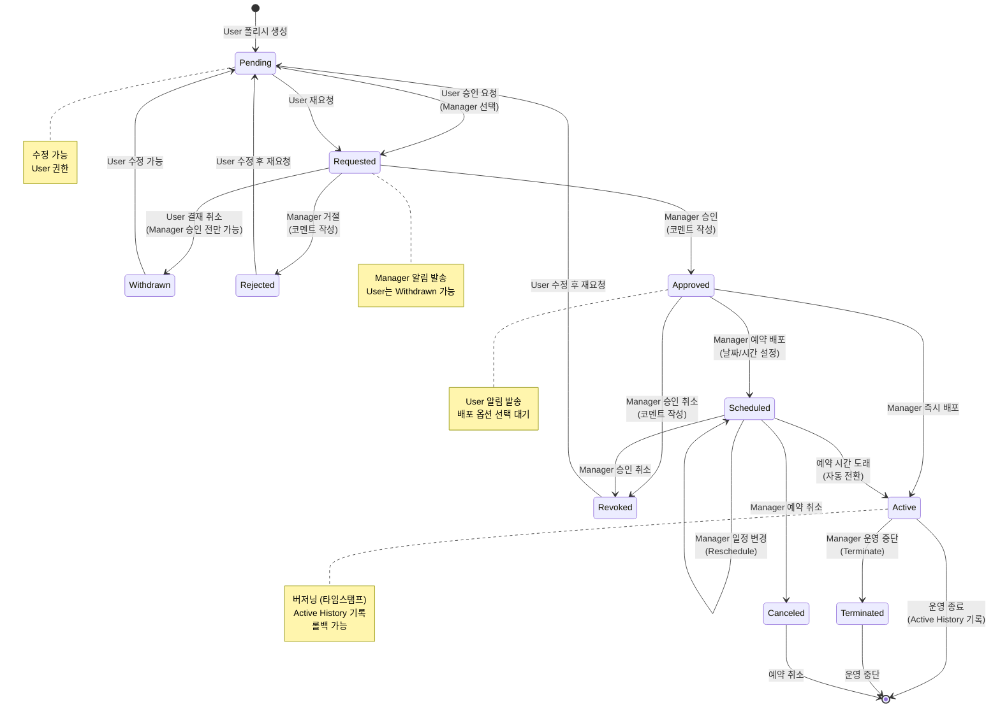
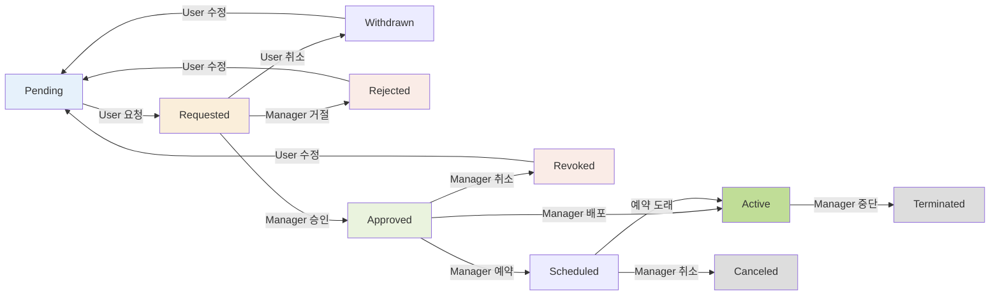
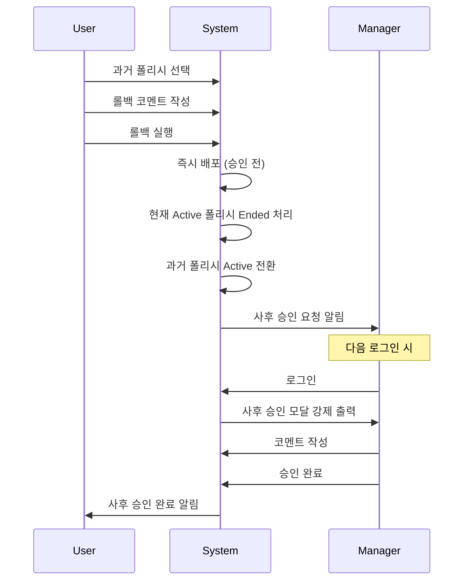

# 폴리시 결재 시스템 플로우

Policy Approval Status 전환 및 알림 시스템

## 폴리시 결재 10단계 상태

### 1. Pending (대기)
**설명**: 폴리시 생성 후 초기 상태

**권한**:
- User: 수정 가능, 승인 요청 가능
- Manager: 조회만 가능

**가능한 액션**:
- 폴리시 수정
- 승인 요청 (→ Requested)
- 삭제

**알림**: 없음

---

### 2. Requested (승인 요청)
**설명**: User가 Manager에게 승인 요청한 상태

**권한**:
- User: 결재 취소 가능 (Manager 승인 전)
- Manager: 승인/거절 권한

**가능한 액션**:
- User: 결재 취소 (→ Withdrawn)
- Manager: 승인 (→ Approved)
- Manager: 거절 (→ Rejected)

**알림**:
- Manager: Requested 알림 발송

---

### 3. Withdrawn (결재 취소)
**설명**: User가 승인 요청을 취소한 상태

**권한**:
- User: 수정 가능, 재요청 가능
- Manager: 조회만 가능

**가능한 액션**:
- 폴리시 수정
- 재요청 (→ Requested)
- 삭제

**알림**:
- Manager: Withdrawn 알림 발송

---

### 4. Approved (승인)
**설명**: Manager가 승인한 상태

**권한**:
- User: 조회만 가능
- Manager: 승인 취소, 배포, 운영 중단 권한

**가능한 액션**:
- Manager: 즉시 배포 (→ Active)
- Manager: 예약 배포 (→ Scheduled)
- Manager: 승인 취소 (→ Revoked)

**알림**:
- User: Approved 알림 발송

---

### 5. Rejected (거절)
**설명**: Manager가 거절한 상태

**권한**:
- User: 수정 가능, 재요청 가능
- Manager: 조회만 가능

**가능한 액션**:
- 폴리시 수정
- 재요청 (→ Requested)
- 삭제

**알림**:
- User: Rejected 알림 발송

**특이사항**:
- Manager 코멘트에 거절 사유 필수

---

### 6. Revoked (승인 취소)
**설명**: Manager가 승인을 취소한 상태

**권한**:
- User: 수정 가능, 재요청 가능
- Manager: 조회만 가능

**가능한 액션**:
- 폴리시 수정
- 재요청 (→ Requested)
- 삭제

**알림**:
- User: Revoked 알림 발송

**특이사항**:
- Manager 코멘트에 취소 사유 필수

---

### 7. Scheduled (운영 예약)
**설명**: Manager가 예약 배포한 상태

**권한**:
- User: 조회만 가능
- Manager: 일정 변경, 승인 취소, 예약 취소 권한

**가능한 액션**:
- Manager: 일정 변경 (Reschedule)
- Manager: 승인 취소 (→ Revoked)
- Manager: 예약 취소 (→ Canceled)
- 자동: 예약 시간 도래 시 Active로 전환

**알림**:
- User: Scheduled 알림 발송

**특이사항**:
- 예약 시간까지 대기
- 예약 시간 도래 시 자동으로 Active 전환

---

### 8. Active (운영 중)
**설명**: 실제 운영 중인 폴리시

**권한**:
- User: 조회만 가능, 롤백 가능
- Manager: 운영 중단 권한

**가능한 액션**:
- Manager: 운영 중단 (→ Terminated)
- User/Manager: 롤백 (과거 버전으로 즉시 전환)

**알림**:
- User: Active 알림 발송 (Scheduled에서 전환 시)

**특이사항**:
- **버저닝 (Versioning)**: 타임스탬프 기록
- **Active History**: 운영 이력 자동 기록
- **한 프로젝트당 1개만 Active 가능**

---

### 9. Terminated (운영 중단)
**설명**: Manager가 운영을 중단한 상태

**권한**:
- User: 조회만 가능, 삭제 가능
- Manager: 조회만 가능

**가능한 액션**:
- User: 삭제
- 조회 및 이력 확인

**알림**: 없음

**특이사항**:
- Active History에 기록 유지

---

### 10. Canceled (운영 취소)
**설명**: Manager가 예약을 취소한 상태

**권한**:
- User: 조회만 가능, 삭제 가능
- Manager: 조회만 가능

**가능한 액션**:
- User: 삭제
- 조회 및 이력 확인

**알림**:
- User: Canceled 알림 발송

**특이사항**:
- Scheduled 상태에서만 가능

---

## 상태 전환 흐름

## 알림 시스템

### Manager가 받는 알림

**Requested**
- User가 승인 요청
- 폴리시명, 요청자, 코멘트 포함

**Withdrawn**
- User가 결재 취소
- 폴리시명, 취소 사유 포함

**Rollback (사후 승인)**
- User가 롤백 실행
- 로그인 시 강제 모달 출력
- 모달 취소/삭제 불가
- 승인만 가능

### User가 받는 알림

**Approved**
- Manager가 승인
- 폴리시명, 승인자, 코멘트 포함

**Rejected**
- Manager가 거절
- 폴리시명, 거절 사유 포함

**Revoked**
- Manager가 승인 취소
- 폴리시명, 취소 사유 포함

**Scheduled**
- 예약 배포 설정
- 폴리시명, 예약 시간 포함

**Canceled**
- 예약 취소
- 폴리시명, 취소 사유 포함

### 알림 보관 정책
- **보관 기간**: 14일
- **자동 삭제**: 14일 후
- **중복 방지**: 동일 폴리시, 동일 상태는 최신 알림만

---

## 코멘트 정책

### 필수 코멘트
- **Approved**: Manager 승인 시
- **Rejected**: Manager 거절 시
- **Revoked**: Manager 승인 취소 시
- **Terminated**: Manager 운영 중단 시
- **Canceled**: Manager 예약 취소 시

### 선택 코멘트
- **Requested**: User 승인 요청 시
- **Withdrawn**: User 결재 취소 시

### 코멘트 전달
- Manager → User: Approved/Rejected/Revoked
- User → Manager: Requested/Withdrawn

---

## 버저닝 (Versioning)

### 버저닝 시점
- **Active 전환 시점**: Scheduled → Active 또는 Approved → Active

### 버전 형식
- **타임스탬프**: YYYY-MM-DD HH:mm:ss
- **예시**: 2026-05-12 14:30:00

### Active History 기록
- 폴리시 전체 내용 스냅샷
- Rules/Matrix 구성
- Segment/Scoring 설정
- 운영 시작/종료 시간

### 조회
- Active History 메뉴에서 조회
- 버전별 상세 내용 확인
- 롤백 가능 (과거 버전 선택)

---

## 롤백 (Rollback)

### 롤백 프로세스

### 롤백 권한
- **User/Manager 모두 가능**
- Active History에서 과거 폴리시 선택

### 롤백 제약
- **현재 Active 폴리시 제외**
- 과거 운영된 폴리시만 가능

### 사후 승인
- 롤백 즉시 배포 (승인 없이)
- Manager 로그인 시 사후 승인 모달 강제 출력
- 모달 취소/삭제 불가
- 승인만 가능

---

## 배포 옵션

### Active (즉시 배포)
- 승인 즉시 운영 시작
- 버저닝 및 Active History 기록
- 한 프로젝트당 1개만 Active

### Scheduled (예약 배포)
- 날짜/시간 설정
- 예약 시간까지 Scheduled 상태 유지
- 예약 시간 도래 시 자동으로 Active 전환
- 일정 변경 (Reschedule) 가능

---

## 상태별 버튼

### 상세 페이지 Step1 (설정)

| 상태 | User 버튼 | Manager 버튼 |
|------|-----------|--------------|
| Pending | [List], [Next] | [List], [Next] |
| Requested | [List], [Next] | [List], [Next] |
| Withdrawn | [List], [Next] | [List], [Next] |
| Approved | [List], [Next] | [List], [Next] |
| Rejected | [List], [Next] | [List], [Next] |
| Revoked | [List], [Next] | [List], [Next] |
| Scheduled | [List], [Next] | [List], [Next] |
| Active | [List], [Next] | [List], [Next] |
| Canceled | [List], [Next] | [List], [Next] |
| Terminated | [List], [Next] | [List], [Next] |

### 상세 페이지 Step2 (승인)

| 상태 | User 버튼 | Manager 버튼 |
|------|-----------|--------------|
| Pending (수정 없음) | [Previous], [List], [Approval Request] | [Previous], [List] |
| Pending (수정 있음) | [Previous], [List], [Save] | [Previous], [List] |
| Requested | [Previous], [List], [Withdraw] | [Previous], [List], [Approve], [Reject] |
| Withdrawn | [Previous], [List], [Approval Request] | [Previous], [List] |
| Approved | [Previous], [List] | [Previous], [List], [Revoke], [Active] |
| Rejected | [Previous], [List], [Save] | [Previous], [List] |
| Revoked | [Previous], [List], [Save] | [Previous], [List] |
| Scheduled | [Previous], [List] | [Previous], [List], [Revoke], [Reschedule] |
| Active | [Previous], [List] | [Previous], [List], [Terminate] |
| Canceled | [Previous], [List], [Delete] | [Previous], [List] |
| Terminated | [Previous], [List], [Delete] | [Previous], [List] |

---

## 특이사항

### 한 프로젝트당 1개의 Active 폴리시
- 새로운 폴리시를 Active로 전환 시
- 기존 Active 폴리시는 자동으로 Ended 처리
- Active History에 기록

### 승인권자 선택
- User가 승인 요청 시 Manager 1명 선택
- 선택된 Manager만 승인/거절 권한
- 선택된 Manager만 알림 수신

### 결재 취소 제한
- **Manager 승인 전**: User가 결재 취소 가능
- **Manager 승인 후**: User가 결재 취소 불가
- Manager만 승인 취소 (Revoke) 가능

### Scheduled 일정 변경
- Reschedule 버튼으로 일정 변경
- 여러 번 변경 가능
- 변경 이력 기록
