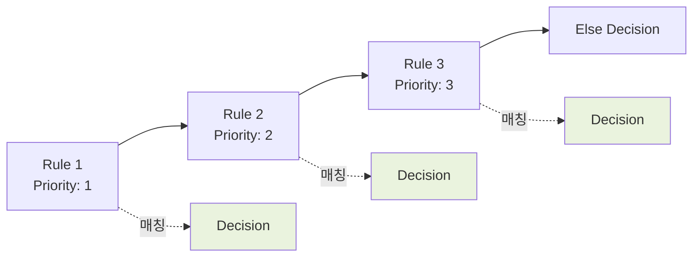
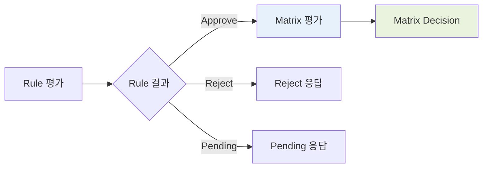

# 실시간 의사결정 시스템 플로우

고객사 트랜잭션 처리 및 Rule/Matrix 평가 프로세스

```mermaid
flowchart TD
    Start[고객사 트랜잭션] -->|API Request| Gateway[API Gateway]
    Gateway --> Auth{인증 확인}
    
    Auth -->|실패| AuthError[401 Unauthorized]
    AuthError --> ErrorResp
    
    Auth -->|성공| ParamMap[Parameter Mapping]
    
    %% Parameter Mapping
    ParamMap --> MapLookup[매핑 테이블 조회<br/>고객사 → IDE 변수]
    MapLookup --> MapCheck{매핑 확인}
    
    MapCheck -->|매핑 없음| MapError[400 Bad Request<br/>매핑 누락]
    MapError --> ErrorResp
    
    MapCheck -->|매핑 확인| ExtractOriginal[원본변수 추출]
    
    %% Derived Variable Calculation
    ExtractOriginal --> DerivedCalc[파생변수 계산]
    DerivedCalc --> EvalCond[Condition 평가]
    EvalCond --> CheckResult{조건 매칭?}
    
    CheckResult -->|Yes| GetResult[Result 값 사용]
    CheckResult -->|No| GetDefault[Default 값 사용]
    
    GetResult --> AllDerived
    GetDefault --> AllDerived[모든 파생변수 완료]
    
    %% Active Policy Retrieval
    AllDerived --> GetPolicy[Active Policy 조회]
    GetPolicy --> CacheCheck{캐시 확인}
    
    CacheCheck -->|Hit| PolicyCached[캐시에서 로드]
    CacheCheck -->|Miss| PolicyDB[DB에서 조회]
    PolicyDB --> CacheStore[캐시 저장]
    CacheStore --> PolicyReady
    PolicyCached --> PolicyReady[Active Policy 준비]
    
    %% Policy Type Check
    PolicyReady --> PolicyType{Policy Type}
    
    PolicyType -->|Rules Only| RulesOnly[Rules Only 평가]
    PolicyType -->|Matrix Only| MatrixOnly[Matrix Only 평가]
    PolicyType -->|Rule + Matrix| RuleMatrix[Rule + Matrix 평가]
    
    %% Rules Only Flow
    RulesOnly --> RulePriority[Rule Priority 순 평가]
    RulePriority --> RuleLoop{다음 Rule?}
    
    RuleLoop -->|Yes| EvalRule[Rule 평가]
    EvalRule --> CondGroup[Condition Group<br/>Priority 순]
    
    CondGroup --> CondMatch{조건 매칭?}
    
    CondMatch -->|Yes| CheckOverride{Override?}
    CondMatch -->|No| NextCondGroup{다음 Condition?}
    
    NextCondGroup -->|Yes| CondGroup
    NextCondGroup -->|No| RuleLoop
    
    CheckOverride -->|Yes| EvalOverride[Override 조건 평가]
    EvalOverride --> OverrideMatch{Override 매칭?}
    
    OverrideMatch -->|Yes| OverrideDecision[Override Decision 적용]
    OverrideMatch -->|No| BaseDecision[Base Decision 적용]
    
    CheckOverride -->|No| BaseDecision
    
    OverrideDecision --> RuleDecision[Rule Decision 확정]
    BaseDecision --> RuleDecision
    
    RuleDecision --> DecisionType{Decision 유형}
    
    DecisionType -->|Approve| RuleApprove[Approve]
    DecisionType -->|Reject| RuleReject[Reject]
    DecisionType -->|Pending| RulePending[Pending]
    
    RuleApprove --> FinalDecision
    RuleReject --> FinalDecision
    RulePending --> FinalDecision
    
    RuleLoop -->|No| ElseDecision[Else Decision 적용]
    ElseDecision --> FinalDecision
    
    %% Matrix Only Flow
    MatrixOnly --> SegmentMatch[Segment 매칭]
    SegmentMatch --> GetParams[파라미터 값 조회]
    GetParams --> FindSegment{Segment 찾기}
    
    FindSegment -->|Found| SegmentFound[Segment 영역 확정]
    FindSegment -->|Not Found| SegmentError[400 Bad Request<br/>Segment 매칭 실패]
    SegmentError --> ErrorResp
    
    SegmentFound --> ScoringCalc[Scoring 계산]
    ScoringCalc --> ScoringType{Scoring Type}
    
    ScoringType -->|Score Card| ScoreCard[Score Card 계산]
    ScoringType -->|AI Model| AIModel[AI Model 추론]
    
    ScoreCard --> CalcScore[가중치 합산<br/>Base Score 추가]
    CalcScore --> Scaling[스케일링]
    
    AIModel --> ModelInfer[모델 추론 요청<br/>BentoML]
    ModelInfer --> ModelResult{추론 결과}
    
    ModelResult -->|성공| ModelScore[모델 점수]
    ModelResult -->|실패| ModelError[500 Internal Error<br/>모델 추론 실패]
    ModelError --> ErrorResp
    
    ModelScore --> Scaling
    
    Scaling --> GradeCalc[Grade 계산<br/>등급 구간]
    GradeCalc --> MatrixDecision[Matrix Decision 조회<br/>Segment × Grade]
    
    MatrixDecision --> FinalDecision
    
    %% Rule + Matrix Flow
    RuleMatrix --> RMRuleEval[Rule 평가 먼저]
    RMRuleEval --> RMRulePriority[Rule Priority 순]
    RMRulePriority --> RMResult{Rule 결과}
    
    RMResult -->|Approve| RMMatrix[Matrix 평가 진행]
    RMResult -->|Reject| RMReject[Reject<br/>Matrix 평가 없음]
    RMResult -->|Pending| RMPending[Pending<br/>Matrix 평가 없음]
    
    RMReject --> FinalDecision
    RMPending --> FinalDecision
    
    RMMatrix --> RMSegment[Segment 매칭]
    RMSegment --> RMScoring[Scoring 계산]
    RMScoring --> RMMatrixDec[Matrix Decision]
    RMMatrixDec --> FinalDecision
    
    %% Final Decision
    FinalDecision[최종 Decision] --> BuildResp[응답 생성]
    
    BuildResp --> AddDecision[Decision 포함<br/>Approve/Reject/Pending]
    AddDecision --> AddAttributes[Attributes 포함<br/>Interest Rate 등]
    AddAttributes --> AddTxID[Transaction ID<br/>타임스탬프]
    AddTxID --> LogTx[트랜잭션 로그 기록]
    
    LogTx --> JSONResp[JSON Response 생성]
    JSONResp --> SendResp[고객사 응답]
    
    %% Error Response
    ErrorResp[에러 응답 생성] --> LogError[에러 로그 기록]
    LogError --> SendError[에러 응답 전송]
    
    SendResp --> End[완료]
    SendError --> End
    
    %% Styling
    classDef inputStyle fill:#e1f5ee,stroke:#333,stroke-width:2px
    classDef processStyle fill:#e6f1fb,stroke:#333,stroke-width:2px
    classDef decisionStyle fill:#faeeda,stroke:#333,stroke-width:2px
    classDef successStyle fill:#eaf3de,stroke:#333,stroke-width:2px
    classDef errorStyle fill:#faece7,stroke:#333,stroke-width:2px
    classDef cacheStyle fill:#fbeaf0,stroke:#333,stroke-width:2px
    
    class Start,Gateway inputStyle
    class ParamMap,DerivedCalc,EvalCond,GetPolicy,BuildResp,JSONResp processStyle
    class Auth,MapCheck,CheckResult,PolicyType,CondMatch,CheckOverride,DecisionType,FindSegment,ScoringType,ModelResult,RMResult decisionStyle
    class FinalDecision,SendResp,End successStyle
    class AuthError,MapError,SegmentError,ModelError,ErrorResp,LogError,SendError errorStyle
    class CacheCheck,PolicyCached,CacheStore cacheStyle
```



## 실시간 의사결정 프로세스

### 1. 요청 수신 및 인증

#### API Gateway
- 고객사 트랜잭션 수신
- HTTP/HTTPS 프로토콜
- REST API 방식

#### 인증 확인
- API Key 또는 토큰 검증
- IP 화이트리스트 확인 (옵션)
- 인증 실패 시: `401 Unauthorized`

### 2. Parameter Mapping

#### 매핑 테이블 조회
- 고객사 파라미터 → IDE 원본변수
- 1:1 매핑 관계

#### 매핑 검증
- 모든 필수 파라미터 매핑 확인
- 매핑 누락 시: `400 Bad Request`

#### 원본변수 추출
- 매핑된 IDE 변수명으로 변환
- 값 추출 및 타입 검증

### 3. 파생변수 계산

#### Condition 평가
```
IF condition_1 THEN result_1
ELSIF condition_2 THEN result_2
...
ELSE default
```

#### 조건 매칭
- AND/OR 조건 평가
- 매칭 순서: 정의 순서대로

#### Result 도출
- 매칭된 조건의 Result 값 사용
- 매칭 없으면 Default 값 사용

#### 모든 파생변수 계산
- 의존 관계 해결
- 순차 계산

### 4. Active Policy 조회

#### 캐시 확인
- Redis 또는 메모리 캐시
- Key: `active_policy:{project_id}`

#### 캐시 Hit
- 캐시에서 폴리시 로드
- 빠른 응답

#### 캐시 Miss
- DB에서 폴리시 조회
- 캐시에 저장
- TTL 설정

### 5. Policy 평가

#### Policy Type 확인
1. **Rules Only**: Rule만 평가
2. **Matrix Only**: Matrix만 평가
3. **Rule + Matrix**: Rule 후 Matrix 평가

---

## Rules Only 평가

### Rule Priority 순 평가



### Condition Group 평가

#### Priority 순서
1. Condition Group 1 (Priority: 1)
2. Condition Group 2 (Priority: 2)
3. ...

#### 조건 유형
- **Static Condition**: 사용자/거래 속성
- **Behavior Pattern**: 행동 기반 신호
- **Static + Behavior**: 조합

#### 매칭 확인
- 모든 조건 만족 시 매칭
- AND/OR 로직 적용

### Override 처리

#### Override 확인
- Condition Group에 Override 설정 여부

#### Override 평가
- Override 조건 평가
- 매칭 시: Override Decision 적용
- 미매칭 시: Base Decision 적용

#### Decision 확정
- Approve/Reject/Pending

### Else Decision
- 모든 Rule에서 매칭 없을 때
- Policy 생성 시 설정한 기본 Decision

---

## Matrix Only 평가

### Segment 매칭

#### 파라미터 값 조회
- 1-3개 Category 타입 파라미터
- 원본변수 또는 파생변수

#### Segment 찾기
- 매트릭스에서 파라미터 값 조합 찾기
- 예시: `Segment[Age=20s][Income=High]`

#### 매칭 실패
- 정의되지 않은 조합
- 에러 응답: `400 Bad Request`

### Scoring 계산

#### Score Card 방식

**가중치 합산:**
```
Score = (Param1_Score × Weight1) 
      + (Param2_Score × Weight2) 
      + ... 
      + Base_Score
```

**스케일링:**
```
Scaled_Score = (Score - Min) / (Max - Min) × 1000
```

**Grade 계산:**
- 등급 구간에 따라 Grade 결정
- 예시: 800-1000 = A, 600-799 = B, ...

#### AI Model 방식

**모델 추론:**
1. BentoML API 호출
2. Feature 값 전달
3. 모델 점수 수신

**스케일링:**
- 모델 점수를 1000점 만점으로 환산

**Grade 계산:**
- Score Card와 동일

### Matrix Decision

#### Decision 조회
```
Matrix[Segment][Grade] = Decision
```

#### Attributes 포함
- Interest Rate
- Loan Amount
- Loan Term
- Prepayment Penalty
- 기타 커스텀 속성

---

## Rule + Matrix 평가

### 평가 순서



### Rule 평가
- Rules Only와 동일한 프로세스
- Approve만 다음 단계로

### Matrix 평가
- Approve된 신청자만 평가
- Matrix Only와 동일한 프로세스

### 최종 Decision
- Matrix Decision이 최종 결과

---

## 응답 생성

### JSON Response 구조

```json
{
  "transaction_id": "2026051214300012345",
  "timestamp": "2026-05-12T14:30:00.123Z",
  "decision": "Approve",
  "attributes": {
    "interest_rate": 4.5,
    "loan_amount": 50000000,
    "loan_term": 36,
    "prepayment_penalty": false
  },
  "segment": "Age_20s_Income_High",
  "grade": "A",
  "score": 850
}
```

### Transaction ID
- 타임스탬프 + 시퀀스 번호
- 고유 식별자

### Decision
- **Approve**: 승인
- **Reject**: 거절
- **Pending**: 보류

### Attributes
- Policy에서 정의한 속성
- Interest Rate, Loan Amount 등

### 추가 정보
- Segment 정보
- Grade 정보
- Score (1000점 만점)

---

## 에러 처리

### 에러 유형

#### 401 Unauthorized
- 인증 실패
- 잘못된 API Key

#### 400 Bad Request
- 매핑 누락
- 필수 파라미터 누락
- Segment 매칭 실패
- 잘못된 파라미터 타입

#### 500 Internal Server Error
- AI 모델 추론 실패
- DB 연결 실패
- 시스템 오류

### 에러 응답 구조

```json
{
  "transaction_id": "2026051214300012345",
  "timestamp": "2026-05-12T14:30:00.123Z",
  "error": {
    "code": "PARAM_MAPPING_ERROR",
    "message": "Parameter 'income' mapping not found",
    "details": {
      "missing_params": ["income"]
    }
  }
}
```

### 로깅
- 에러 스택 기록
- 디버깅 정보
- 재현 가능한 정보

---

## 성능 최적화

### 캐싱 전략

#### Active Policy 캐싱
- TTL: 5분 (기본)
- Invalidation: 폴리시 변경 시

#### Parameter Mapping 캐싱
- TTL: 10분
- Invalidation: 매핑 변경 시

#### 파생변수 계산 결과
- 동일 트랜잭션 내에서만 캐싱
- 재사용하지 않음

### 병렬 처리

#### 파생변수 계산
- 의존 관계 없는 변수는 병렬 계산

#### Rule 평가
- 순차 평가 (Priority 때문)

#### Matrix 평가
- Segment 매칭과 Scoring 병렬 가능

### 타임아웃

#### AI Model 추론
- 타임아웃: 3초 (기본)
- 실패 시 에러 응답

#### DB 쿼리
- 타임아웃: 1초
- 실패 시 재시도 (최대 2회)

---

## 로깅 및 모니터링

### 트랜잭션 로그

**기록 항목:**
- Transaction ID
- Request 시간
- Response 시간
- 처리 시간
- Decision
- 사용된 Policy Version

### 성능 메트릭

**측정 항목:**
- 평균 응답 시간
- P95 응답 시간
- P99 응답 시간
- 처리량 (TPS)

### 알림

**알림 조건:**
- 응답 시간 SLA 초과
- 에러율 임계값 초과
- AI 모델 추론 실패율 증가

---

## 특이사항

### Category 타입 외 값 처리

#### 기본 정책 (Flow 진행)
- 세그먼트: 매칭 실패 에러
- 스코어링: 0점 처리 후 flag 전달

#### 대체 정책 (즉시 에러)
- 고객사 요청 시 적용
- Flow 전에 에러 응답

### DataStore 쿼리 실행
- 바인드 변수 치환
- 단일 행 검증
- 결과 없으면 0 또는 Null 반환

### 동시 요청 처리
- Stateless 아키텍처
- 수평 확장 가능
- 로드 밸런싱
