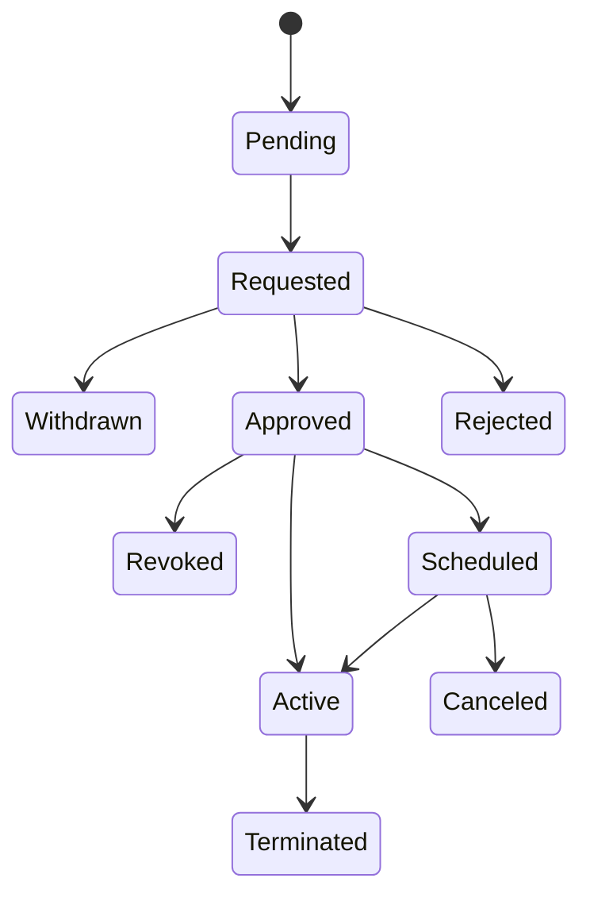

# System Flows

백엔드 시스템 아키텍처 및 데이터 처리 흐름 문서

## 📖 개요

CDE 시스템의 백엔드 아키텍처와 주요 데이터 처리 프로세스를 정의합니다.

---

## 🏗️ 시스템 아키텍처

### [01. 전체 시스템 아키텍처](./01-overall-architecture.md)

5개 레이어로 구성된 시스템 아키텍처

#### 레이어 구조

```
┌─────────────────────────────────────────┐
│     고객사 트랜잭션 (API Gateway)         │
└─────────────────┬───────────────────────┘
                  │
┌─────────────────▼───────────────────────┐
│      인증/권한 레이어                     │
│  Authentication & Authorization         │
└─────────────────┬───────────────────────┘
                  │
┌─────────────────▼───────────────────────┐
│      애플리케이션 레이어                  │
│  Project | Test | Management Module     │
└─────────────────┬───────────────────────┘
                  │
┌─────────────────▼───────────────────────┐
│      데이터 처리 레이어                   │
│  Parameter Engine | Decision Engine     │
│  Approval Workflow                       │
└─────────────────┬───────────────────────┘
                  │
┌─────────────────▼───────────────────────┐
│      통합 레이어                          │
│  Data Store | AI Engine | Notification  │
└─────────────────┬───────────────────────┘
                  │
┌─────────────────▼───────────────────────┐
│      데이터 저장소                        │
│  Database | Cache | Logging              │
└─────────────────────────────────────────┘
```

#### 실시간 의사결정 흐름
```
요청 수신 → Parameter 매핑 → 파생변수 계산 
→ Active Policy 실행 → Decision 응답
```

---

## 📊 데이터 처리 흐름

### [02. 파라미터 처리 플로우](./02-parameter-processing.md)

원본변수와 파생변수 처리 프로세스

#### 원본변수 생성

**6가지 입력 소스:**
1. **직접 입력**: 변수명/타입/밸류 직접 입력
2. **File Upload**: CSV/Excel 파일
3. **URL Import**: 외부 주소에서 가져오기
4. **Model Import**: AI Model Dataset
5. **Project Import**: 다른 프로젝트에서
6. **DataStore Query**: SQL 쿼리 실행

**처리 프로세스:**
```
입력 → 유효성 검증 → 중복 체크 → 저장 → 정렬 → 매핑
```

#### 파생변수 생성

**프로세스:**
```
기반 변수 선택 → Condition 설정 → Result 정의 
→ Default 설정 → 테스트 → 저장
```

**Condition 평가:**
```
IF condition_1 THEN result_1
ELSIF condition_2 THEN result_2
...
ELSE default
```

#### DataStore 쿼리

**바인드 변수:**
```sql
SELECT AVG(amt) FROM TB_CARD 
WHERE user_id = :user_id
```

**검증 규칙:**
- 단일 행 반환 필수
- 실행시간 0.5초 이하 권장
- 바인드 변수 사전 등록 필수

---

### [03. 폴리시 결재 플로우](./03-policy-approval.md)

Policy Approval 10단계 상태 전환 및 알림 시스템

#### 10단계 상태



| 단계 | 상태 | 설명 | User | Manager |
|------|------|------|------|---------|
| 1 | Pending | 대기 | 수정 가능 | 조회만 |
| 2 | Requested | 승인 요청 | 취소 가능 | 승인/거절 |
| 3 | Withdrawn | 결재 취소 | 수정 가능 | 조회만 |
| 4 | Approved | 승인 | 조회만 | 배포/취소 |
| 5 | Rejected | 거절 | 수정 가능 | 조회만 |
| 6 | Revoked | 승인 취소 | 수정 가능 | 조회만 |
| 7 | Scheduled | 운영 예약 | 조회만 | 일정 변경 |
| 8 | Active | 운영 중 | 조회/롤백 | 중단 |
| 9 | Terminated | 운영 중단 | 조회/삭제 | 조회만 |
| 10 | Canceled | 운영 취소 | 조회/삭제 | 조회만 |

#### 알림 시스템

**Manager 수신:**
- 📩 Requested (User 승인 요청)
- 📩 Withdrawn (User 결재 취소)
- 📩 Rollback (사후 승인 필요)

**User 수신:**
- 📩 Approved (승인 완료)
- 📩 Rejected (거절)
- 📩 Revoked (승인 취소)
- 📩 Scheduled (운영 예약)
- 📩 Canceled (운영 취소)

**보관 정책:** 14일 보관 후 자동 삭제

#### 버저닝 (Versioning)

**시점:** Active 전환 시
**형식:** 타임스탬프 (YYYY-MM-DD HH:mm:ss)
**기록:** Active History에 스냅샷 저장

#### 롤백 (Rollback)

**프로세스:**
1. User/Manager가 과거 폴리시 선택
2. 코멘트 작성 후 롤백 실행
3. 즉시 배포 (승인 전)
4. Manager 로그인 시 사후 승인 모달 강제 출력
5. Manager 승인 완료

---

### [04. 실시간 의사결정 플로우](./04-realtime-decision.md)

고객사 트랜잭션 실시간 처리 프로세스

#### 처리 단계

```
1. 요청 수신 → API Gateway
2. 인증 확인 → API Key 검증
3. Parameter 매핑 → 고객사 → IDE 변수
4. 파생변수 계산 → Condition 평가
5. Active Policy 조회 → 캐시 우선
6. Policy 평가 → Rules/Matrix
7. Decision 응답 → JSON
```

#### 3가지 Policy 타입

##### 1. Rules Only

**평가 순서:**
```
Rule 1 (Priority: 1)
→ Rule 2 (Priority: 2)
→ Rule 3 (Priority: 3)
→ Else Decision
```

**Condition Group:**
- Priority 순서 평가
- Static/Behavior/Mixed 조건
- Override 처리

**결과:**
- Approve/Reject/Pending

##### 2. Matrix Only

**Segment 매칭:**
```
Segment[Age][Income] = Segment 영역
```

**Scoring 계산:**
- **Score Card**: 가중치 합산 → 스케일링
- **AI Model**: BentoML 추론 → 스케일링

**Grade 결정:**
```
Score → Grade (A/B/C/...)
```

**Matrix Decision:**
```
Matrix[Segment][Grade] = Decision + Attributes
```

##### 3. Rule + Matrix

**평가 순서:**
```
1. Rule 평가
   ├─ Approve → Matrix 평가
   ├─ Reject → 종료
   └─ Pending → 종료

2. Matrix 평가 (Approve만)
   └─ Matrix Decision
```

#### 응답 구조

```json
{
  "transaction_id": "2026051214300012345",
  "timestamp": "2026-05-12T14:30:00.123Z",
  "decision": "Approve",
  "attributes": {
    "interest_rate": 4.5,
    "loan_amount": 50000000,
    "loan_term": 36,
    "prepayment_penalty": false
  },
  "segment": "Age_20s_Income_High",
  "grade": "A",
  "score": 850
}
```

#### 에러 처리

| 상태 코드 | 원인 | 응답 |
|-----------|------|------|
| 401 | 인증 실패 | Unauthorized |
| 400 | 매핑 누락, Segment 매칭 실패 | Bad Request |
| 500 | 모델 추론 실패, 시스템 오류 | Internal Error |

---

## 🔧 기술 스택

### 백엔드
- **API**: REST API
- **인증**: API Key / Token
- **캐싱**: Redis
- **데이터베이스**: RDB (PostgreSQL/MySQL)
- **AI 엔진**: BentoML

### 통합
- **Data Store**: SQL 쿼리 (Push/Pull)
- **알림**: Email (SMTP)
- **로깅**: 구조화된 로그 (JSON)

---

## 📈 성능 요구사항

### SLA
- **응답 시간**: 고객사와 협의
- **처리량**: TPS (Transactions Per Second)
- **가용성**: 99.9% 이상

### 캐싱 전략

| 항목 | TTL | Invalidation |
|------|-----|--------------|
| Active Policy | 5분 | 폴리시 변경 시 |
| Parameter Mapping | 10분 | 매핑 변경 시 |
| 세션 | 30분 | 로그아웃 시 |

### 타임아웃

| 작업 | 타임아웃 | 재시도 |
|------|----------|--------|
| AI Model 추론 | 3초 | 없음 |
| DB 쿼리 | 1초 | 최대 2회 |
| DataStore 쿼리 | 0.5초 권장 | - |

---

## 🔒 보안

### 인증/인가
- 세션 기반 인증
- 30분 타임아웃
- 동시 접속 방지
- 로그인 실패 5회 시 30분 잠금

### 데이터 암호화
- 비밀번호 암호화 저장
- HTTPS 통신
- 민감 정보 마스킹

### 로깅/감사
- 전체 트랜잭션 로그
- 에러 스택 추적
- 감사 로그 90일 보관

---

## 📊 모니터링

### 성능 메트릭
- 평균 응답 시간
- P95/P99 응답 시간
- 처리량 (TPS)
- 에러율

### 알림 조건
- 응답 시간 SLA 초과
- 에러율 임계값 초과
- AI 모델 추론 실패율 증가
- 시스템 리소스 임계값 초과

---

## 🧪 테스트

### 단위 테스트
- Parameter Engine
- Decision Engine
- Approval Workflow

### 통합 테스트
- Rule 평가
- Matrix 평가
- Rule + Matrix 평가

### 성능 테스트
- 부하 테스트 (Load Test)
- 스트레스 테스트 (Stress Test)
- 내구성 테스트 (Endurance Test)

---

## 🔄 배포 프로세스

### CI/CD
1. 코드 커밋
2. 자동 테스트
3. 스테이징 배포
4. 승인 후 프로덕션 배포

### 롤백 계획
- 이전 버전으로 즉시 롤백 가능
- 데이터베이스 마이그레이션 고려
- Active History 활용

---

## 📝 다이어그램 읽는 법

### Flowchart 기호
- **사각형**: 프로세스
- **마름모**: 의사결정
- **둥근 사각형**: 시작/종료
- **원형**: 연결점
- **실선 화살표**: 주요 흐름
- **점선 화살표**: 선택적 흐름/참조

### State Diagram 기호
- **상태**: 둥근 사각형
- **전환**: 화살표
- **초기 상태**: 검은 원
- **최종 상태**: 이중 원

---

## 🔗 관련 문서

- [Information Architecture](../information-architecture.md)
- [User Flows](../user-flows/)
- [정책 문서](../../정책)

---

## 📞 기술 지원

시스템 아키텍처 관련 문의는 백엔드 팀에 연락해주세요.

---

**Last Updated**: 2026-05-12
**Version**: 1.0.0
