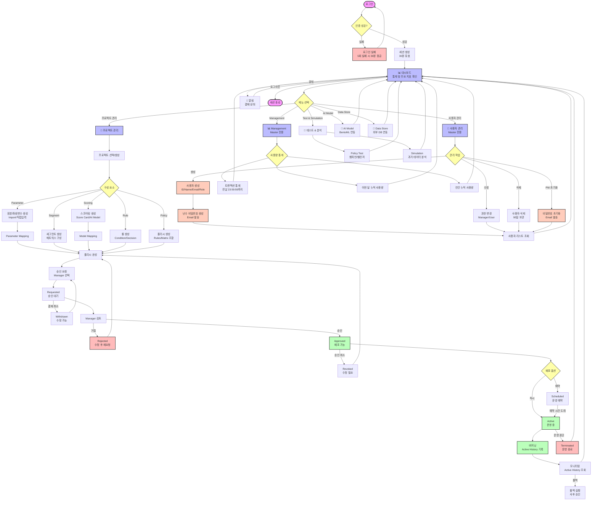

# Master 사용자 플로우

Master 권한 사용자의 시스템 사용 흐름도

## Master 사용자 주요 권한

### 1. 전체 메뉴 접근
- Dashboard, Project, Test & Simulation, AI Model, Data Store
- **Management 메뉴 독점 접근**

### 2. 프로젝트 관리
- Parameter, Segment, Scoring, Rule, Policy 생성/수정/삭제
- 폴리시 승인 요청 및 배포
- 운영 이력 조회 및 롤백

### 3. 사용자 관리 (Master 전용)
- **사용자 생성**: ID/Name/Email/Role 지정
- **권한 할당**: Manager/User 권한 부여
- **비밀번호 관리**: 초기화 및 난수 생성
- **사용자 삭제**: 90일 보관 후 완전 삭제

### 4. 통계 조회 (Master 전용)
- 트랜잭션 통계 (전날까지)
- 월간/연간 누적 사용량

### 5. 폴리시 결재
- 승인 요청 → Manager 선택
- 결재 취소 (Withdrawn)
- 승인 후 배포 (Active/Scheduled)
- 운영 중단 권한

## 주요 프로세스

### 사용자 생성 프로세스
1. ID/Name/Email 입력
2. Role 선택 (Manager/User)
3. 시스템이 난수 비밀번호 생성
4. Email로 비밀번호 발송
5. 사용자 첫 로그인 시 비밀번호 변경 필수

### 폴리시 배포 프로세스
1. 폴리시 생성 (Rules/Matrix 조합)
2. 승인 요청 (Manager 선택)
3. Manager 승인
4. 배포 옵션 선택:
   - **Active**: 즉시 운영
   - **Scheduled**: 예약 운영
5. 버저닝 및 Active History 기록
6. 모니터링 및 롤백 가능

### 알림 수신
- 폴리시 결재 상태 변경 시 알림
- Requested, Withdrawn, Approved, Rejected, Revoked, Scheduled, Canceled
- 알림 14일 보관

## 특이사항

### 동시 접속 제한
- 동일 아이디로 동시 접속 불가
- 신규 로그인 시 기존 세션 로그아웃

### 세션 관리
- 세션 타임아웃: 30분
- 자동 로그인 기능 없음

### 로그인 보안
- 로그인 실패 5회 시 30분 계정 잠금
- 30분 후 자동으로 잠금 해제
- 비밀번호 틀린 횟수 초기화
