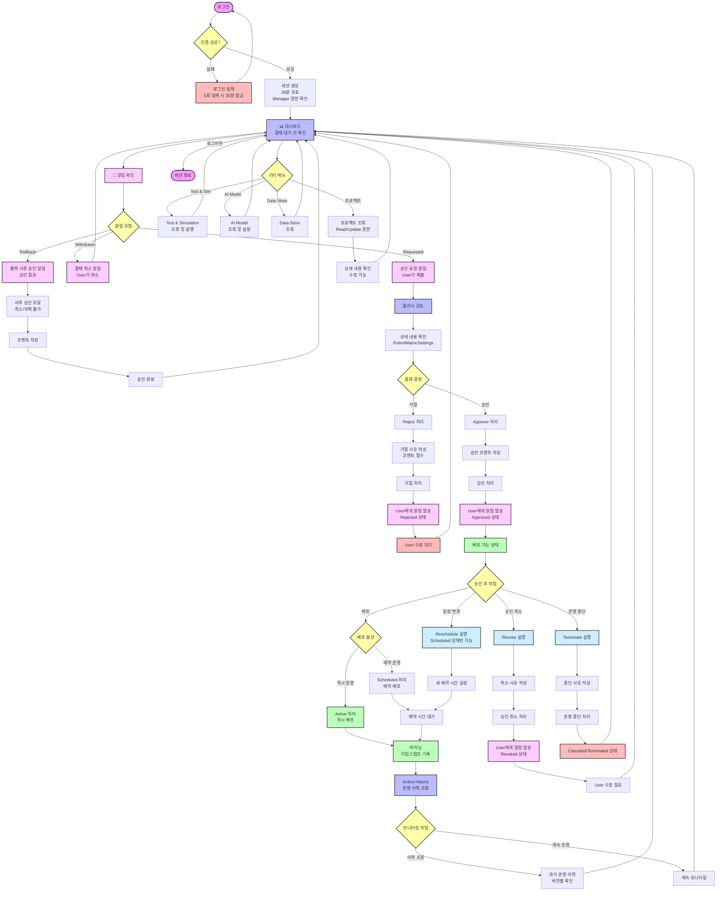

# Manager 사용자 플로우

Manager 권한 사용자의 시스템 사용 흐름도 - 결재 승인 중심

## Manager 사용자 주요 권한

### 1. 폴리시 결재 권한 (핵심 역할)
- **승인 요청 검토**: User가 제출한 폴리시 검토
- **승인/거절 결정**: Approve 또는 Reject 처리
- **코멘트 작성**: 결재 사유 필수 작성
- **알림 수신**: Requested, Withdrawn 상태 알림

### 2. 승인 후 관리 권한
- **승인 취소 (Revoke)**: 승인한 폴리시 취소
- **운영 중단 (Terminate)**: 운영 중인 폴리시 중단
- **일정 변경 (Reschedule)**: 예약된 폴리시 일정 수정
- **배포 실행**: Active 또는 Scheduled 처리

### 3. 사후 승인 처리
- 롤백 시 사후 승인 모달 강제 출력
- 모달 취소/삭제 불가
- 코멘트 작성 및 승인만 가능

### 4. 프로젝트 조회 권한
- 모든 프로젝트 Read 권한
- 일부 Update 권한 (이름 변경 등)
- CRUD 권한 없음 (생성/삭제 불가)

### 5. 기타 메뉴 접근
- Test & Simulation 조회 및 실행
- AI Model 조회
- Data Store 조회
- **Management 메뉴 접근 불가**

## 주요 프로세스

### 승인 프로세스
1. Dashboard에서 결재 대기 건 확인
2. 알림 클릭 또는 직접 조회
3. 폴리시 상세 내용 확인
   - Rules 구성
   - Matrix 설정
   - Segment/Scoring
4. 결재 결정:
   - **승인**: 코멘트 작성 → Approve → User 알림
   - **거절**: 사유 작성 → Reject → User 알림
5. User는 알림 수신 후 조치

### 거절 프로세스
1. 거절 사유 코멘트 작성 (필수)
2. Reject 처리
3. User에게 알림 발송
4. User는 폴리시 수정 후 재요청 가능

### 배포 프로세스 (승인 후)
1. Approved 상태 폴리시 선택
2. 배포 옵션 선택:
   - **Active**: 즉시 운영 시작
   - **Scheduled**: 예약 시간 설정
3. 버저닝 (타임스탬프 기록)
4. Active History에 기록
5. 모니터링

### 승인 취소 (Revoke) 프로세스
1. Approved 상태 폴리시 선택
2. Revoke 버튼 클릭
3. 취소 사유 코멘트 작성
4. Revoke 처리
5. User에게 알림 발송
6. User는 수정 후 재요청 가능

### 운영 중단 (Terminate) 프로세스
1. Active 또는 Scheduled 상태 폴리시 선택
2. Terminate 버튼 클릭
3. 중단 사유 코멘트 작성
4. Terminate 처리
5. Canceled/Terminated 상태로 변경

### 사후 승인 프로세스 (롤백)
1. User가 과거 폴리시로 롤백 실행
2. 즉시 배포 (승인 전)
3. Manager 로그인 시 사후 승인 모달 강제 출력
4. 코멘트 작성
5. 승인 완료 (모달 취소 불가)

## 알림 시스템

### Manager가 받는 알림
- **Requested**: User가 승인 요청
- **Withdrawn**: User가 결재 취소
- **Rollback**: 롤백 사후 승인 필요

### Manager가 보내는 알림 (User에게)
- **Approved**: 승인 완료
- **Rejected**: 거절
- **Revoked**: 승인 취소

### 알림 보관 정책
- 14일 보관
- 자동 삭제

## 특이사항

### 결재 권한
- 한 번에 한 명의 Manager만 지정 가능
- 승인권자로 지정된 Manager만 알림 수신
- 다른 Manager는 조회만 가능

### 코멘트 작성
- 승인/거절/취소 시 코멘트 작성 필수
- 코멘트는 User에게 전달
- 이력으로 기록

### 모니터링
- Active History에서 운영 이력 조회
- 버전별 폴리시 내용 확인
- 롤백 내역 확인

### Management 메뉴 제한
- User 생성/삭제 불가
- 사용량 통계 조회 불가
- Master 전용 기능
