# User 사용자 플로우

User 권한 사용자의 시스템 사용 흐름도 - 프로젝트 관리 중심

```mermaid
flowchart TD
    Start([로그인]) --> FirstLogin{첫 로그인?}
    
    FirstLogin -->|Yes| InitPW[Master가 전송한<br/>난수 비밀번호로 로그인]
    InitPW --> ChangePW[비밀번호 변경 모달<br/>강제 출력]
    ChangePW --> NewPW[새 비밀번호 설정<br/>PW 정책 준수]
    NewPW --> Session
    
    FirstLogin -->|No| Auth{인증 성공?}
    Auth -->|실패| LoginFail[로그인 실패<br/>5회 실패 시 30분 잠금]
    LoginFail --> Start
    
    Auth -->|성공| Session[세션 생성<br/>30분 유효]
    Session --> Dashboard[📊 대시보드<br/>프로젝트 현황 확인]
    
    Dashboard --> CheckNoti[🔔 알림 확인]
    CheckNoti --> NotiType{알림 유형}
    
    NotiType -->|Approved| AppNoti[승인 알림<br/>배포 가능]
    NotiType -->|Rejected| RejNoti[거절 알림<br/>수정 필요]
    NotiType -->|Revoked| RevNoti[승인 취소 알림<br/>수정 필요]
    NotiType -->|Scheduled| SchNoti[예약 알림<br/>배포 예정]
    NotiType -->|Canceled| CanNoti[운영 취소 알림]
    
    AppNoti --> Dashboard
    RejNoti --> ProjectSelect
    RevNoti --> ProjectSelect
    SchNoti --> Dashboard
    CanNoti --> Dashboard
    
    %% Project Selection
    Dashboard --> ProjectSelect{프로젝트 선택}
    ProjectSelect -->|기존 프로젝트| ExistProject[프로젝트 선택]
    ProjectSelect -->|새 프로젝트| CreateProject[프로젝트 생성<br/>이름만 입력]
    
    CreateProject --> ProjectHome[프로젝트 홈]
    ExistProject --> ProjectHome
    
    %% Project Components
    ProjectHome --> Components{구성 요소 선택}
    
    %% Parameter Branch
    Components -->|Parameter| ParamMenu[Parameter 관리]
    ParamMenu --> ParamType{변수 유형}
    
    ParamType -->|원본변수| OriginalVar[원본변수 생성]
    OriginalVar --> InputMethod{입력 방법}
    
    InputMethod -->|직접 입력| DirectInput[변수명/타입/밸류<br/>직접 입력]
    InputMethod -->|파일| FileImport[CSV/Excel<br/>파일 업로드]
    InputMethod -->|URL| URLImport[URL에서<br/>가져오기]
    InputMethod -->|모델| ModelImport[AI Model<br/>Dataset 가져오기]
    InputMethod -->|프로젝트| ProjImport[다른 프로젝트에서<br/>가져오기]
    InputMethod -->|쿼리| QueryInput[DataStore<br/>SQL 쿼리 작성]
    
    DirectInput --> ValidateParam[유효성 검증<br/>중복 체크]
    FileImport --> ValidateParam
    URLImport --> ValidateParam
    ModelImport --> ValidateParam
    ProjImport --> ValidateParam
    QueryInput --> QueryTest[쿼리 테스트<br/>단일 행 검증]
    QueryTest --> ValidateParam
    
    ValidateParam --> SaveParam[원본변수 저장<br/>정렬 0-9, A-Z, ㄱ-ㅎ]
    SaveParam --> ParamMapping[Parameter Mapping<br/>고객사 변수 매핑]
    ParamMapping --> ParamComplete[원본변수 완료]
    
    ParamType -->|파생변수| DerivedVar[파생변수 생성]
    DerivedVar --> SelectBase[원본변수 선택<br/>또는 파생변수]
    SelectBase --> SetCondition[Condition 설정<br/>AND/OR 조건]
    SetCondition --> SetResult[Result 값 정의<br/>타입별]
    SetResult --> SetDefault[Default 값 설정<br/>조건 외 처리]
    SetDefault --> TestCond[컨디션 테스트<br/>테스트 값 입력]
    TestCond --> SaveDerived[파생변수 저장]
    SaveDerived --> ParamComplete
    
    ParamComplete --> PolicyFlow
    
    %% Segment Branch
    Components -->|Segment| SegmentMenu[Segment 생성]
    SegmentMenu --> SelectParams[파라미터 선택<br/>1-3개 Category 타입]
    SelectParams --> GetMatrix[매트릭스 생성<br/>X/Y 축 설정]
    GetMatrix --> NameSegments[세그먼트 영역<br/>이름 설정]
    NameSegments --> SegmentComplete[세그먼트 완료]
    SegmentComplete --> PolicyFlow
    
    %% Scoring Branch
    Components -->|Scoring| ScoringMenu[Scoring 생성]
    ScoringMenu --> ScoringType{스코어링 타입}
    
    ScoringType -->|Score Card| ScoreCard[Score Card]
    ScoreCard --> SelectScoreParam[파라미터 선택<br/>Category 타입]
    SelectScoreParam --> SetScore[스코어/가중치 입력<br/>Criteria 설정]
    SetScore --> SetGrade[등급 구간 설정<br/>Min/Max Score]
    SetGrade --> ScoreComplete[Score Card 완료]
    
    ScoringType -->|AI Model| AIModel[AI Model]
    AIModel --> SelectModel[모델 선택<br/>BentoML]
    SelectModel --> ModelMapping[Model Mapping<br/>Feature → Parameter]
    ModelMapping --> AdjustScore[스케일링/등급<br/>재조정]
    AdjustScore --> ScoreComplete
    
    ScoreComplete --> PolicyFlow
    
    %% Rule Branch
    Components -->|Rule| RuleMenu[Rule 생성]
    RuleMenu --> CreateCondGroup[Condition Group 생성]
    CreateCondGroup --> CondType{조건 유형}
    
    CondType -->|Static| StaticCond[Static Condition<br/>사용자/거래 속성]
    CondType -->|Behavior| BehaviorCond[Behavior Pattern<br/>행동 기반 신호]
    CondType -->|Mixed| MixedCond[Static + Behavior<br/>AND/OR 조합]
    
    StaticCond --> SetDecision
    BehaviorCond --> SetDecision
    MixedCond --> SetDecision
    
    SetDecision[Decision 설정<br/>Approve/Reject/Pending] --> SetPriority[Priority 설정<br/>평가 순서]
    SetPriority --> OverrideOption{Override 설정?}
    
    OverrideOption -->|Yes| SetOverride[Override Decision<br/>예외 처리]
    OverrideOption -->|No| RuleTest
    SetOverride --> RuleTest[Rule Test<br/>통합 테스트]
    
    RuleTest --> RuleComplete[Rule 완료]
    RuleComplete --> PolicyFlow
    
    %% Policy Branch
    Components -->|Policy| PolicyMenu[Policy 생성]
    PolicyMenu --> PolicyType{Policy 타입}
    
    PolicyType -->|Rules Only| RulesOnly[Rules Only<br/>Rule 선택]
    RulesOnly --> SelectRules[Rule 1개 이상 선택<br/>상충 체크]
    SelectRules --> SetElse[Else Decision 설정<br/>기본 결정]
    SetElse --> PolicyComplete
    
    PolicyType -->|Matrix Only| MatrixOnly[Matrix Only<br/>Segment × Scoring]
    MatrixOnly --> SelectSegScore[Segment/Scoring 선택<br/>No Segment 가능]
    SelectSegScore --> CreateMatrix[매트릭스 생성<br/>Decision 설정]
    CreateMatrix --> PolicyComplete
    
    PolicyType -->|Rule + Matrix| RuleMatrix[Rule + Matrix<br/>복합]
    RuleMatrix --> SelectRulesMatrix[Rule 선택<br/>Segment/Scoring 선택]
    SelectRulesMatrix --> SetMatrixDec[Matrix Decision 설정<br/>Rule 후 평가]
    SetMatrixDec --> PolicyComplete
    
    PolicyComplete[Policy 완료<br/>Pending 상태] --> PolicyFlow
    
    %% Policy Approval Flow
    PolicyFlow --> ApprovalReq[승인 요청<br/>Manager 선택]
    ApprovalReq --> AddComment[코멘트 작성]
    AddComment --> SubmitReq[승인 요청 제출]
    SubmitReq --> Requested[Requested<br/>승인 대기]
    
    Requested --> CanWithdraw{결재 취소 가능?}
    CanWithdraw -->|Manager 승인 전| Withdraw[Withdrawn<br/>결재 취소]
    Withdraw --> ModifyPolicy[폴리시 수정]
    ModifyPolicy --> ApprovalReq
    
    CanWithdraw -->|Manager 승인 후| WaitResult[결과 대기<br/>알림 수신]
    
    WaitResult --> Result{결재 결과}
    
    Result -->|Approved| ApprovedState[Approved<br/>승인 완료<br/>알림 수신]
    Result -->|Rejected| RejectedState[Rejected<br/>거절됨<br/>알림 수신]
    Result -->|Revoked| RevokedState[Revoked<br/>승인 취소<br/>알림 수신]
    
    ApprovedState --> DeployWait[Manager 배포 대기]
    DeployWait --> DeployResult{배포 결과}
    
    DeployResult -->|Active| ActiveState[Active<br/>운영 중<br/>알림 수신]
    DeployResult -->|Scheduled| ScheduledState[Scheduled<br/>운영 예약<br/>알림 수신]
    DeployResult -->|Canceled| CanceledState[Canceled<br/>운영 취소<br/>알림 수신]
    
    ActiveState --> Monitor[Active History<br/>운영 이력 조회]
    ScheduledState --> Monitor
    
    RejectedState --> ModifyPolicy
    RevokedState --> ModifyPolicy
    CanceledState --> Dashboard
    
    %% Additional Features
    Dashboard --> AddFeatures{추가 기능}
    
    AddFeatures -->|Policy Test| PolicyTest[Policy Test<br/>챔피언/챌린저]
    PolicyTest --> SetupTest[테스트 설정<br/>기간/타겟]
    SetupTest --> RunTest[테스트 실행<br/>Running 상태]
    RunTest --> TestResult[결과 레포트<br/>회차별 분석]
    TestResult --> Dashboard
    
    AddFeatures -->|Simulation| Simulation[Simulation<br/>과거 데이터]
    Simulation --> SetupSim[시뮬레이션 설정<br/>Target/Period]
    SetupSim --> RunSim[시뮬레이션 실행]
    RunSim --> SimResult[결과 분석]
    SimResult --> Dashboard
    
    AddFeatures -->|Active History| ActiveHist[Active History<br/>운영 이력]
    ActiveHist --> ViewHistory[버전별 조회<br/>롤백 가능]
    ViewHistory --> RollbackOption{롤백?}
    
    RollbackOption -->|Yes| ExecuteRollback[롤백 실행<br/>즉시 배포]
    ExecuteRollback --> PostApproval[Manager 사후 승인<br/>대기]
    PostApproval --> Dashboard
    
    RollbackOption -->|No| Dashboard
    
    Monitor --> Dashboard
    
    %% Profile Management
    Dashboard --> Profile{Profile 관리}
    Profile -->|비밀번호 변경| ChangePWProfile[비밀번호 변경<br/>Profile 페이지]
    ChangePWProfile --> LogoutAfterPW[로그아웃<br/>재로그인 필요]
    LogoutAfterPW --> Start
    
    %% Logout
    Dashboard -->|로그아웃| Logout([세션 종료])
    
    %% Styling
    classDef authStyle fill:#f9f,stroke:#333,stroke-width:2px
    classDef processStyle fill:#bbf,stroke:#333,stroke-width:2px
    classDef decisionStyle fill:#ffa,stroke:#333,stroke-width:2px
    classDef successStyle fill:#bfb,stroke:#333,stroke-width:2px
    classDef errorStyle fill:#fbb,stroke:#333,stroke-width:2px
    classDef notiStyle fill:#fcf,stroke:#333,stroke-width:2px
    classDef compStyle fill:#cff,stroke:#333,stroke-width:2px
    
    class Start,Logout,LogoutAfterPW authStyle
    class Dashboard,ProjectHome,ParamMenu,SegmentMenu,ScoringMenu,RuleMenu,PolicyMenu processStyle
    class FirstLogin,Auth,ProjectSelect,Components,ParamType,InputMethod,ScoringType,CondType,PolicyType,OverrideOption,CanWithdraw,Result,DeployResult,RollbackOption,AddFeatures,Profile decisionStyle
    class ApprovedState,ActiveState,ScoreComplete,PolicyComplete successStyle
    class LoginFail,RejectedState,CanceledState errorStyle
    class CheckNoti,AppNoti,RejNoti,RevNoti,SchNoti,CanNoti notiStyle
    class ParamComplete,SegmentComplete,RuleComplete compStyle
```

## User 사용자 주요 권한

### 1. 프로젝트 전체 관리 (CRUD)
- **Parameter**: 원본변수 + 파생변수 생성/수정/삭제
- **Segment**: 세그먼트 매트릭스 생성/수정/삭제
- **Scoring**: Score Card / AI Model 생성/수정/삭제
- **Rule**: 의사결정 규칙 생성/수정/삭제
- **Policy**: 최종 정책 생성/수정/삭제

### 2. 폴리시 승인 요청
- Manager 선택 후 승인 요청
- 코멘트 작성
- 결재 취소 (Withdrawn) - Manager 승인 전만 가능

### 3. 알림 수신
- **Approved**: 승인 완료
- **Rejected**: 거절 (수정 후 재요청)
- **Revoked**: 승인 취소 (수정 후 재요청)
- **Scheduled**: 운영 예약
- **Canceled**: 운영 취소

### 4. 테스트 & 분석
- **Policy Test**: 챔피언/챌린저 A/B 테스트
- **Simulation**: 과거 데이터 시뮬레이션
- **Active History**: 운영 이력 조회 및 롤백

### 5. 제한 사항
- **Management 메뉴 접근 불가**
- **사용자 생성/삭제 불가**
- **다른 사용자 권한 수정 불가**
- **승인/거절 권한 없음**

## 주요 프로세스

### 첫 로그인 프로세스
1. Master가 생성한 난수 비밀번호로 로그인
2. 로그인 성공 시 비밀번호 변경 모달 강제 출력
3. 새 비밀번호 설정 (PW 정책 준수 필수)
4. 변경 완료 후 실제 서비스 로그인

### 원본변수 생성 프로세스
**6가지 입력 방법:**
1. **직접 입력**: 변수명/타입/밸류 직접 입력
2. **파일 업로드**: CSV/Excel 파일
3. **URL**: 외부 주소에서 가져오기
4. **모델**: AI Model Dataset 가져오기
5. **프로젝트**: 다른 프로젝트에서 가져오기
6. **쿼리**: DataStore SQL 쿼리 실행

**공통 프로세스:**
- 유효성 검증
- 중복 체크 (이름/타입/밸류)
- 저장 및 정렬
- Parameter Mapping

### 파생변수 생성 프로세스
1. 원본변수 또는 파생변수 선택
2. Condition 설정 (AND/OR 조건)
3. Result 값 정의 (타입별)
4. Default 값 설정 (조건 외 처리)
5. 컨디션 테스트 (선택)
6. 저장

### 세그먼트 생성 프로세스
1. Category 타입 파라미터 1-3개 선택
2. 매트릭스 자동 생성
3. X/Y 축 설정
4. 세그먼트 영역 이름 설정
5. 저장

### 스코어링 생성 프로세스

**Score Card:**
1. Category 타입 파라미터 선택
2. 스코어/가중치 입력
3. Criteria 설정 (Number 타입)
4. 등급 구간 설정 (Min/Max Score)
5. 저장

**AI Model:**
1. BentoML 모델 선택
2. Model Mapping (Feature → Parameter)
3. 타입 일치 확인
4. 스케일링/등급 재조정
5. 저장

### Rule 생성 프로세스
1. Condition Group 생성
2. 조건 유형 선택:
   - **Static**: 사용자/거래 속성
   - **Behavior**: 행동 기반 신호
   - **Mixed**: Static + Behavior 조합
3. Decision 설정 (Approve/Reject/Pending)
4. Priority 설정 (평가 순서)
5. Override 설정 (선택)
6. Rule Test (통합 테스트)
7. 저장

### Policy 생성 프로세스

**3가지 타입:**

1. **Rules Only**
   - Rule 1개 이상 선택
   - 상충 체크
   - Else Decision 설정

2. **Matrix Only**
   - Segment/Scoring 선택 (No Segment 가능)
   - 매트릭스 생성
   - Decision 설정

3. **Rule + Matrix**
   - Rule 선택
   - Segment/Scoring 선택
   - Matrix Decision 설정
   - Rule 후 Matrix 평가

### 폴리시 승인 프로세스
1. Policy 완성 (Pending 상태)
2. Manager 선택
3. 코멘트 작성
4. 승인 요청 제출
5. Requested 상태 전환
6. Manager 승인 전까지 결재 취소 가능
7. 결과 대기:
   - **Approved**: 배포 대기
   - **Rejected**: 수정 후 재요청
   - **Revoked**: 수정 후 재요청

### Policy Test 프로세스
1. 챔피언 폴리시 선택 (운영 중)
2. 챌린저 폴리시 선택 (비운영)
3. 테스트 기간 설정
4. 타겟 조건 설정 (선택)
5. 테스트 실행 (Running)
6. 24시간 후 결과 데이터 확인
7. 회차별 레포트 분석

### Simulation 프로세스
1. Test Target 선택 (Scoring/Policy)
2. Historical Data Period 선택
3. Baseline Policy 선택
4. 시뮬레이션 실행
5. 즉시 결과 확인 (진행률 0%부터)
6. 결과 분석

### 롤백 프로세스
1. Active History 조회
2. 과거 폴리시 선택
3. 코멘트 작성
4. 롤백 실행 (즉시 배포)
5. Manager 사후 승인 대기
6. 승인 완료

## 비밀번호 정책

### 규칙
- **최소 길이**: 영문/숫자/기호 3가지 사용 8자 이상
- **최대 사용 기간**: 6개월
- **최소 사용 기간**: 1일 (당일 재변경 불가)
- **최신 PW 기억**: 1개 (최근 비밀번호 사용 불가)

### 복잡성
- 빈문자열(스페이스) 포함 불가
- 동일 문자 3개 이상 반복 불가
- 1234 등 숫자 순차 3개 이상 불가
- ID 포함 불가

### 변경
- Profile 페이지에서 변경 가능
- 변경 후 로그아웃 → 재로그인 필요

## In Use 상태 관리

### In Use 정의
- 파생변수/룰/세그먼트/스코어링/폴리시에 사용 중
- 운영 중인 폴리시에 사용 중

### 제한 사항
- **수정 불가**: 이름 제외 모든 값
- **삭제 불가**: 체크박스 비활성화
- **복제 가능**: 복제 후 수정하여 사용

### 표시
- 🔗 아이콘 출력
- In Use 배너 출력
- Currently In Use 상세 조회 가능

## 특이사항

### 동시 접속 제한
- 동일 아이디로 동시 접속 불가
- 신규 로그인 시 기존 세션 로그아웃

### 세션 관리
- 세션 타임아웃: 30분
- 자동 로그인 기능 없음

### 로그인 보안
- 로그인 실패 5회 시 30분 계정 잠금
- 30분 후 자동으로 잠금 해제
